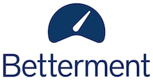

  **Quick Links:**
  [Talk Recordings](recordings.html)
  &middot;
  [Venue](venue-accessibility.html)
  &middot;
  [Program](program.html)
  &middot;
  [Speakers](speakers.html)
  &middot;
  [Conduct](conduct.html)

**!!Con** (pronounced "bang bang con") **2016** was **two days of
ten-minute talks** (with lots of breaks, of course!) to celebrate the
joyous, exciting, and surprising moments in programming. Check out our
[speaker lineup](speakers.html)!

    

    

    

    

    

    

    

    

    

    

    

    

    

    

    

    

    

    

    

    

    

    

    

    

    

    

    

    

    

    

    

    

## Where and when?

!!Con 2016 was held on Saturday, May 7 and Sunday, May 8, 2016 at
<a href="http://thehallbrooklyn.com/">the Hall at MP</a> in Brooklyn,
NYC.  Check out our
[venue and accessibility information](venue-accessibility.html)!

!!Con 2016 was *pay-what-you-want*.  [Registration](https://www.eventbrite.com/e/con-2016-tickets-24695082657) is now closed.

## Why should you go to !!Con?

This is what last year's speakers and attendees had to say:

> "@bangbangcon was so **consistently delightful and awesome the
> entire weekend through**, for the second year in a row." --
> [@gredaline](https://twitter.com/gredaline/status/600314795951284224)

> "@bangbangcon is **by far the coolest conference I've been to**" --
> [@bcjbcjbcj](https://twitter.com/bcjbcjbcj/status/600050898837086208)

> "I had a wonderful time at @bangbangcon! Such **welcoming people
> doing fun and fascinating work**." --
> [@Bruce_Adams](https://twitter.com/Bruce_Adams/status/600112896010387456)

> "**one of the finest events I've had the honor to be part of**" --
> [@shovemedia](https://twitter.com/shovemedia/status/600066059345985537)

> "Had the BEST weekend @bangbangcon! **I now want to build and write
> and make ALL THE THINGS!!**" --
> [@kiranb](https://twitter.com/kiranb/status/600129399762100226)

> "I have had **an incredible weekend**, again, full of wonderful,
> kind people and fascinating things learned. Thank you so much,
> @bangbangcon!" --
> [@jczetta](https://twitter.com/jczetta/status/600148410650472448)

> "I want every day to be @bangbangcon, **best conference ever**" --
> [@ablwr](https://twitter.com/ablwr/status/599727141660524546)

We hope !!Con 2016 was at least as good!

## How do I get updates?

For updates on !!Con, follow
[@bangbangcon](https://twitter.com/bangbangcon) on Twitter, or sign up
for our mailing list below! No spam, we promise!

<!-- Begin MailChimp Signup Form -->

<form action="http://bangbangcon.us3.list-manage.com/subscribe/post?u=37b924b9d7d71dc7aa1a52b4c&amp;id=9f9ec7c469" method="post" id="mc-embedded-subscribe-form" name="mc-embedded-subscribe-form" class="validate" target="_blank" style="background-color: inherit;" novalidate>

<label for="mce-EMAIL">Email:</label>
<input type="email" value="" name="EMAIL" class="required email" id="mce-EMAIL" placeholder='your email address'>
<input type="submit" value="Subscribe" name="subscribe" id="mc-embedded-subscribe" class="button">

<!-- real people should not fill this in and expect good things - do not remove this or risk form bot signups-->

<input type="text" name="b_37b924b9d7d71dc7aa1a52b4c_9f9ec7c469" value="">

</form>

## Who organized all this?

The !!Con 2016 organizing team:
[Alex Clemmer](https://twitter.com/hausdorff_space),
[Danielle Sucher](https://twitter.com/DanielleSucher),
[Erty Seidohl](https://twitter.com/ertyseidohl),
[Leo Franchi](https://twitter.com/lfranchi),
[Lindsey Kuper](https://twitter.com/lindsey), and
[Nabil Hassein](https://twitter.com/NabilHassein).  Organizers
emeritae: [Julia Evans](https://twitter.com/b0rk) and
[Maggie Zhou](https://twitter.com/zmagg).  Logo design and additional
web wrangling by [Lea Albaugh](http://twitter.com/doridoidea).

## Code of Conduct

We had a [code of conduct](conduct.html) that all !!Con participants
were required to observe.

## Sponsors

Thank you to our amazing sponsors for helping make !!Con possible!

    <h3>EXCELLENT!! Sponsors</h3>
    
<a href="https://managedbyq.com" target="_blank">.

</a>

    <h3>AWESOME! Sponsors</h3>
    
<a href="http://devbootcamp.com" target="_blank">.

</a>

    
<a href="http://stridenyc.com" target="_blank">.

</a>

    
<a href="https://meetup.com" target="_blank">.

</a>

    
<a href="https://stripe.com" target="_blank">.

</a>

    
<a href="https://betterment.com" target="_blank">.

</a>

    
<a href="https://soundcloud.com" target="_blank">.

</a>

    <h3>Individual Sponsors</h3>
        
Thank you so much to our individual sponsors who contributed to making !!Con possible!

    

        <a href="http://twitter.com/shovemedia">Jon Williams</a> 
        <a href="http://twitter.com/lastontheboat" target="_blank">Josh Matthews</a> 
        Igor 
        <a href="http://www.ashedryden.com">Ashe Dryden</a> 
        Scott Vokes 
        <a href="http://lars.hupel.info/">Lars Hupel</a> 
	...and <strong>7</strong> anonymous individual sponsors.
    

Our [sponsorship page](sponsors.html) shows the benefits that were available to sponsors!
