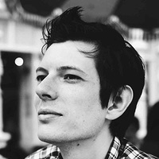
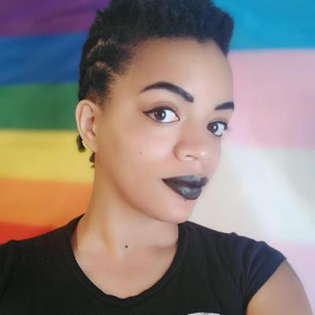
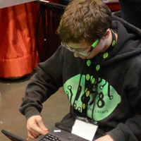
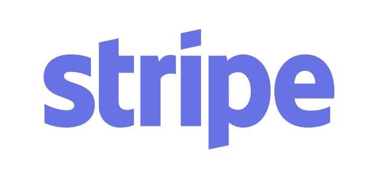
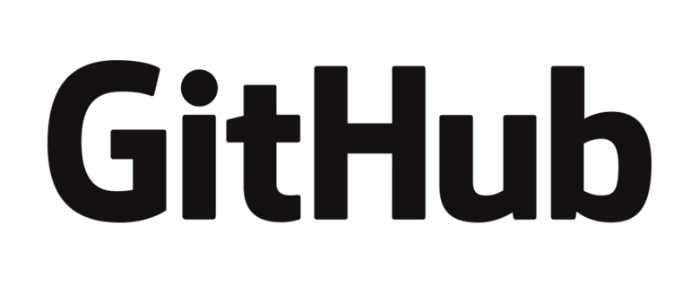
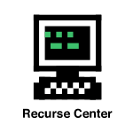

**!!Con** (pronounced "bang bang con") **West** was a two-day conference of ten-minute talks about the joy, excitement, and surprise of computing, and the west-coast successor to [!!Con](http://bangbangcon.com/)!  It was held in Santa Cruz, California, on the campus of [UC Santa Cruz](https://www.ucsc.edu/), on **February 23-24, 2019!**

!!Con West was a pay-what-you-want conference, with tickets that were
completely **sold
out**; we sold our tickets [on Eventbrite](https://www.eventbrite.com/e/con-west-2019-tickets-54792734544)!

!!Con West was also livestreamed (sponsored by our EXCELLENT!! friends
at <a href="https://stripe.com/" target="_blank">Stripe</a>) and recorded;
if you missed attending in person, you can watch all 32 of our amazing speakers on <a
href="https://www.youtube.com/playlist?list=PLofFli6PGTsB0QpGpJdVxFZDoLhXwQCx4">our
YouTube channel</a>!

## Who spoke?

Two amazing keynote speakers (<a href='speakers.html#lynn-cyrin'>Lynn Cyrin</a>
and <a href='speakers.html#vj-um-amel'>VJ Um Amel</a>), and <a
href="speakers.html">30 other amazing speakers</a>!  We were incredibly excited by
this year's talk line-up, and we know that you will be too -- <a
href="speakers.html">check it out</a>!

Our [call for talk proposals](cfp.html) is now closed.  Thanks to everyone who submitted one!

## What was the schedule of the event?

The rough schedule looked like this for both days:

* Registration opens at 9am. Continental breakfast will be available.
* First talk starts at 10:30am.
* Boxed lunch will be served around 12:30pm.
* Wrap-up will end by 5pm.

The [detailed program](program.html) has more information.

## How do I get updates on future !!Cons West?

Follow us on Twitter at [@bangbangconwest](https://twitter.com/bangbangconwest)!

You can also subscribe to our mailing list!  We send roughly five emails a year, and we'll never share your email address with anyone else.

<!-- Begin Mailchimp Signup Form -->
<link href="//cdn-images.mailchimp.com/embedcode/classic-10_7.css" rel="stylesheet" type="text/css">

<form action="https://bangbangcon.us19.list-manage.com/subscribe/post?u=00c2875b2973e3d496870d29f&amp;id=34dcab8a59" method="post" id="mc-embedded-subscribe-form" name="mc-embedded-subscribe-form" class="validate" target="_blank" novalidate>
    

	<h2>Subscribe to the !!Con West mailing list!!</h2>

	<label for="mce-EMAIL">Email Address </label>
	<input type="email" value="" name="EMAIL" class="required email" id="mce-EMAIL">

	

		

		

	
    <!-- real people should not fill this in and expect good things - do not remove this or risk form bot signups-->
    
<input type="text" name="b_00c2875b2973e3d496870d29f_34dcab8a59" tabindex="-1" value="">

    
<input type="submit" value="Subscribe" name="subscribe" id="mc-embedded-subscribe" class="button">

    

</form>

<!--End mc_embed_signup-->

## Who sponsored?

We had a [sponsorship
prospectus](sponsors.html) available, or sponsors could [get in touch](mailto:bangbangcon.west@gmail.com)!

<!-- otherwise hugo gets confused -->

### PHENOMENAL!!! Sponsors

	<a href="https://www.soe.ucsc.edu" target="_blank">
	.
	

		
		

	</a>

	<a href="https://www.mailchimp.com/" target="_blank">
	.
	

		
		

	</a>

---

### EXCELLENT!! Sponsors

	<a href="https://stripe.com/ca" target="_blank">
	.
	

		
		

	</a>

	<a href="https://airtable.com/" target="_blank">
	.
	

		
		

	</a>

	<a href="https://github.com/" target="_blank">
	.
	

		
		

	</a>

	<a href="https://twilio.com/" target="_blank">
	.
	

		
		

	</a>

---

### AWESOME! Sponsors

	<a href="https://www.recurse.com" target="_blank">
	.
	

		
		

	</a>

## Who organized?

The !!Con West 2019 organizing team was
[Dema Abu Adas](https://twitter.com/human_dema),
[Dev Purandare](https://twitter.com/dev14e),
[Janice Shiu](https://twitter.com/contrepoint21),
[Jeena Lee](https://twitter.com/thejeenalee),
[Jessica Rudder](https://twitter.com/jessrudder),
[Joshua Wise](https://joshuawise.com/),
[Lindsey Kuper](http://composition.al),
[Maggie Zhou](https://twitter.com/zmagg),
[Sara Chicazul](https://twitter.com/chicazul),
and [Taylor Hodge](https://twitter.com/jtaylorhodge).

[Send us an e-mail](mailto:bangbangcon.west@gmail.com) if you'd like to get
in touch.
