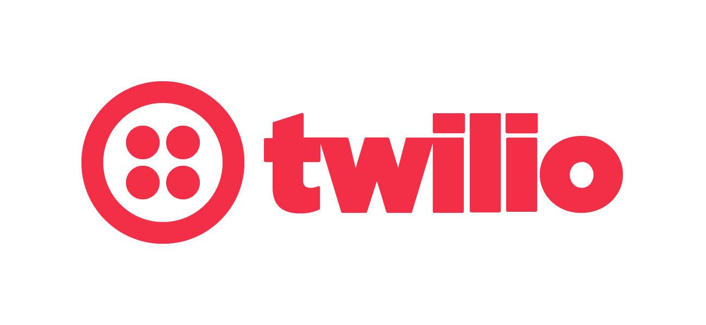
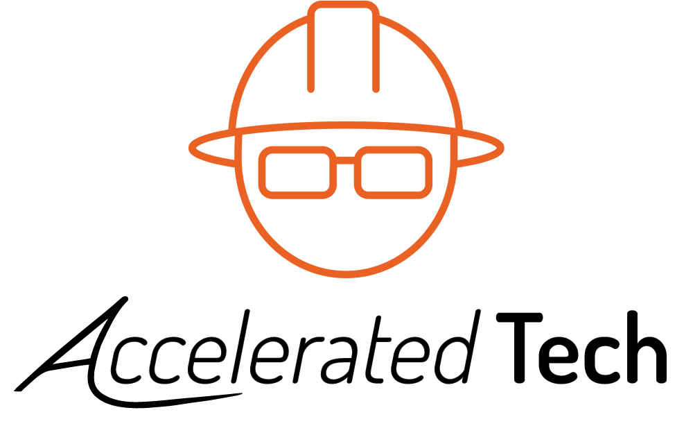
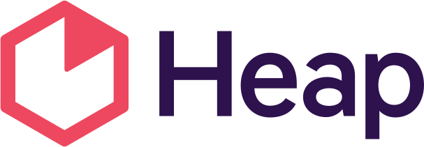

**!!Con** (pronounced "bang bang con") **West** was a two-day conference of
ten-minute talks about the joy, excitement, and surprise of computing, and the
west-coast successor to [!!Con](http://bangbangcon.com/)! It was held in Santa
Cruz, California, on the campus of [UC Santa Cruz](https://www.ucsc.edu/), on
**February 29th and March 1st, 2020!**

!!Con West was a pay-what-you-want conference; tickets that were completely sold
out.

## Who spoke?

We had [26 incredible speakers this year](speakers.html), including our three
amazing keynote speakers, [isis agora
lovecruft](speakers#isis-agora-lovecruft), [Erin Rose
Glass](speakers#erin-rose-glass), and [Kate Compton](speakers#kate-compton)!  We were
incredibly excited by this year's talk line-up; video recordings will be
available soon, sponsored by Recurse Center.

## How do I get updates on future !!Cons West?

Follow us on Twitter at [@bangbangconwest](https://twitter.com/bangbangconwest)!

You can also subscribe to our mailing list!  We send roughly five emails a year,
and we'll never share your email address with anyone else.

<!-- Begin Mailchimp Signup Form -->
<link href="//cdn-images.mailchimp.com/embedcode/classic-10_7.css" rel="stylesheet" type="text/css"> 

<form action="https://bangbangcon.us19.list-manage.com/subscribe/post?u=00c2875b2973e3d496870d29f&id=34dcab8a59" method="post" id="mc-embedded-subscribe-form" name="mc-embedded-subscribe-form" class="validate" target="_blank" novalidate>

  

    

    <label for="mce-EMAIL">Email Address </label>
    <input type="email" value="" name="EMAIL" class="required email" id="mce-EMAIL">
    <input type="submit" value="Subscribe" name="subscribe" id="mc-embedded-subscribe" class="button">
    

  

  

    

    

  
    <!-- real people should not fill this in and expect good things - do not remove this or risk form bot signups-->
  

    <input type="text" name="b_00c2875b2973e3d496870d29f_34dcab8a59" tabindex="-1" value="">
  

</form>

 <!--End mc_embed_signup-->

## Who sponsored?

We had a [sponsorship prospectus](sponsors.html), or sponsors could [get
in touch](mailto:west-2020@exclamation.foundation)!

<!-- otherwise hugo gets confused -->

### PHENOMENAL!!! Sponsors

	<a href="https://www.soe.ucsc.edu" target="_blank">
	.
	

		
		

	</a>

	<a href="https://www.lightstep.com/" target="_blank">
	.
	

		
		

	</a>

---

### EXCELLENT!! Sponsors

	<a href="https://www.twilio.com" target="_blank">
	.
	

		
		

	</a>

---

### AWESOME! Sponsors

	<a href="https://www.recurse.com" target="_blank">
	.
	

		
		

	</a>

	<a href="https://accelerated.tech" target="_blank">
	.
	

		
		

	</a>

 <!-- force a line break by overflowing. you learn new CSS tricks every day! -->

	<a href="https://www.mapbox.com/" target="_blank">
	.
	

		
		

	</a>

	<a href="https://heap.io/" target="_blank">
	.
	

		
		

	</a>

---

### Other sponsorship

Recurse Center sponsored live video streaming and the recorded talks;
LightStep sponsored our famous open captioning, and Saturday's delicious lunch!

## Who's organized?

The !!Con West 2020 organizing team was
[Dema Abu Adas](https://twitter.com/human_dema),
[Dev Purandare](https://twitter.com/dev14e),
[Gargi Sharma](https://twitter.com/gawwrgi),
[Jeena Lee](https://twitter.com/thejeenalee),
[Joshua Wise](https://joshuawise.com/),
[Lindsey Kuper](http://composition.al),
and [Varun Gandhi](https://twitter.com/cutculus).

[Send us an e-mail](mailto:west-2020@exclamation.foundation) if you'd like to get
in touch.
