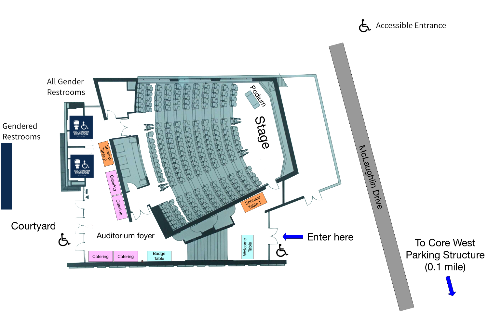

# Getting to !!Con West 2020

We're excited to bring **!!Con West 2020** to scenic Santa Cruz, California,
on the campus of [UC Santa Cruz](https://www.ucsc.edu/), from February 29
to March 1. Santa Cruz is a joy of coastal California redwoods, about an
hour's drive from the bustle of Silicon Valley. We will hold **!!Con
West** in the [Jack Baskin
Auditorium](https://www.google.com/maps/place/Jack+Baskin+Auditorium+101/@36.9997031,-122.0630586,17.32z/data=!4m5!3m4!1s0x808e4175229558fb:0x8d521799d868891c!8m2!3d37.000183!4d-122.0623527),
with registration starting at 9am each day, and talks ending around 5pm.

<iframe width="600" height="500"
id="gmap_canvas"
src="https://maps.google.com/maps?q=baskin%20auditorium&t=&z=17&ie=UTF8&iwloc=&output=embed"
frameborder="0" scrolling="no" marginheight="0"
marginwidth="0"></iframe>

## Getting to Santa Cruz

For registered attendees, we have sent you information about a Slack in
which you can discuss carpooling with each other.  If you haven't received
that invitation, please [let us
know](mailto:west-2020@exclamation.foundation).

### By car from the Bay Area

- The best way to get to Santa Cruz from most of the Peninsula is by way of
  CA-17, which takes you from CA-85 through the Santa Cruz mountains into the
  city.
- Please make sure you leave sufficiently early, as CA-17 gets heavy traffic
  southbound on weekends.
- Another option, if coming from San Francisco, is to drive down by way of Half
  Moon Bay on CA-1, which would take about an hour and a half without traffic.
- On rainy days, CA-17 can present adverse conditions, including car crashes and
  mudslides, sometimes even leading to closure of the highway and long delays.
- Please make sure to drive carefully and check the local news for transit
  conditions.

### By air

The best options for getting in and out of the Bay Area by air are either
through San Francisco (SFO), or through San Jose (SJC).  There are tradeoffs
for each; there are more flights in and out of SFO, but SJC is about half an
hour to an hour closer to Santa Cruz. Both airports have shuttle options to
Santa Cruz, if you don't wish to rent a car (UCSC has a decent
[list of options](https://taps.ucsc.edu/travel/airport-shuttles.html)).

### By other alternatives including public transit

- Santa Cruz is somewhat remote and the public transit options are limited, but
  getting there without driving or flying is possible!
- There are [Greyhound](https://www.greyhound.com) options from San Francisco
  and Oakland to [Santa Cruz Greyhound
  Station](https://locations.greyhound.com/bus-stations/US/Santa-Cruz).
- The nearest Amtrak/Caltrain station is San Jose Diridon Station (SJC).
- If you're coming from Anaheim, Burbank, or Los Angeles and wish to take a bus,
  [Megabus](https://us.megabus.com/) also offers a few options to San Jose
  Diridon Station (SJC).

### From San Jose Diridon Station to Santa Cruz, you can take:

- the [Highway 17
  Express](https://www.scmtd.com/en/component/systemmap/17/20192) bus
- [Greyhound](https://www.greyhound.com)
- a taxi (estimated cost about $100)
- a rideshare (estimated cost about $50)

Extremely adventurous attendees could choose to bike to Santa Cruz; from the
middle of the Peninsula, [one possible
route](https://www.strava.com/routes/11228019) is about 45 miles with about
3,800ft of elevation gain. (If you try this, or have a better route, [let us
know](mailto:west-2020@exclamation.foundation)!)

---

## Getting from Santa Cruz to Jack Baskin Auditorium

### By shuttle

We're providing *free shuttle buses* to help !!Con attendees get between the conference, the [Hampton Inn Santa Cruz](https://goo.gl/maps/VSDYfQtWZEz), and [downtown Santa Cruz](https://goo.gl/maps/t1UhFcoyxWx)!  The shuttle schedule will be the
same for both conference days. The times shown are the departure times from the
pick-up location.

Keep in mind that depending on road conditions, the shuttles might arrive 5-10 minutes late.

Hampton Inn is graciously letting !!Con West use the hotel as a shuttle stop.
They have a tiny lobby, and they asked us to wait out front. They have a large
overhang, so you will stay dry!

**Morning**

[Hampton Inn](https://goo.gl/maps/VSDYfQtWZEz) → Baskin Auditorium

* 8:45am
* 9:30am

[Southwest corner of Pacific Ave. and Cathcart St. (on Cathcart St. next to Old School Shoes)](https://goo.gl/maps/t1UhFcoyxWx) → Baskin Auditorium

<iframe width="600" height="500" id="gmap_canvas" src="https://maps.google.com/maps?q=208-246%20Cathcart%20St%2C%20Santa%20Cruz%2C%20CA%2095060&t=&z=17&ie=UTF8&iwloc=&output=embed" frameborder="0" scrolling="no" marginheight="0" marginwidth="0"></iframe>

* 8:55am
* 9:40am

**Evening**

Baskin Auditorium → Southwest corner of Pacific Ave. and Cathcart St. and Hampton Inn

* Saturday: 5:10pm (arriving 5:25pm at Cathcart St., and 5:30pm at Hampton Inn)
* Sunday: 4:40pm (arriving 4:55pm at Cathcart St., and 5:10pm at Hampton Inn)

### By car

You can park your car (free on weekends!) at the [Core West parking
structure](https://www.google.com/maps/place/UCSC+Core+West+Structure/@36.9990766,-122.0658659,17z/data=!3m1!4b1!4m5!3m4!1s0x808e417574d7cc95:0xfc9187c7cae8a8c2!8m2!3d36.9990766!4d-122.0636772),
which is about a 5-minute walk from the auditorium. There are accessible parking
spaces closer to the venue. There's a [mobile-friendly website with live
information on open parking spaces at Core
West](https://mobile.ucsc.edu/parking/corewest).

<iframe width="600" height="500"
id="gmap_canvas"
src="https://maps.google.com/maps?q=ucsc%20core%20west&t=&z=17&ie=UTF8&iwloc=&output=embed"
frameborder="0" scrolling="no" marginheight="0"
marginwidth="0"></iframe>

### By public transit

Santa Cruz Metro offers several bus lines within the city; a few of them will
get you to the auditorium from the city center. Please consult the [Santa Cruz
Metro website](https://www.scmtd.com/en/routes) or Google Maps for the bus
schedule.

### By rideshare

There are both rideshare options (Lyft, etc.) and car sharing options (Zipcar)
available in Santa Cruz.

---

## More venue details and accessibility information

Venue map (click for a bigger version):

Our venue this year accommodates about 200 people (and we expect to be
completely full)!

- !!Con West is an **alcohol-free event**.
- All ages are welcome.
- The building has an accessible entrance (no steps).
- The venue will have two single-occupancy gender-neutral restrooms in the same
  building as the auditorium; additionally, there are gender-labeled restrooms
  in adjacent buildings.
- A secure, private space will be made available for anybody who needs a
  lactation room.  Please ask a conference organizer, and we'll be happy to get
  you access.
- **!!Con West** will have CART ("Communication Access Realtime Transcription",
  or "Computer-Assisted Real-Time", depending on who you ask) live transcription
  in English.

We want to make !!Con West accessible to as many attendees as possible.  If you
have questions about our venue, or the accessibility thereof, please [contact
the !!Con West organizers](mailto:west-2020@exclamation.foundation).
