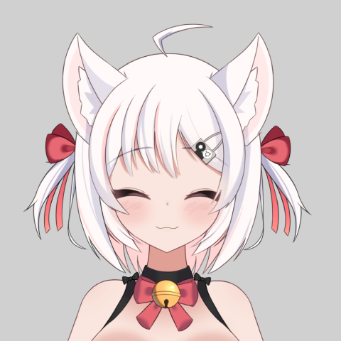
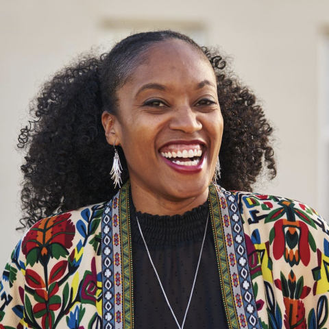
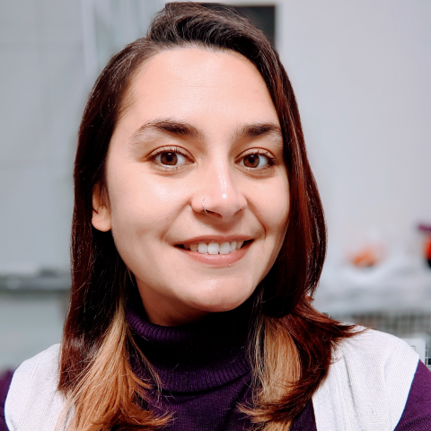
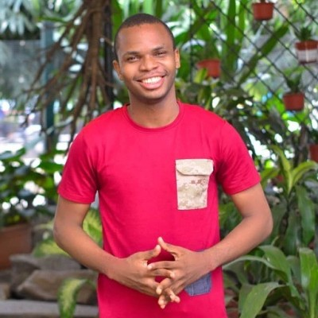
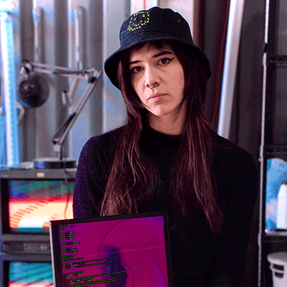
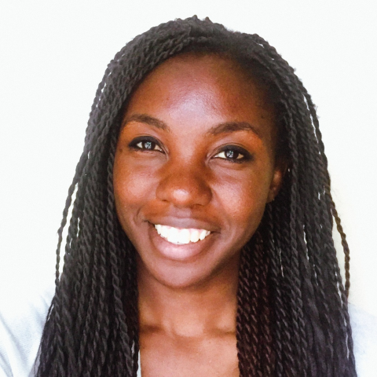
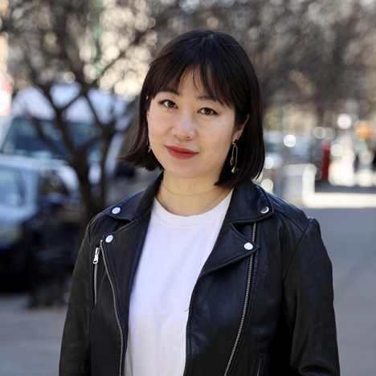
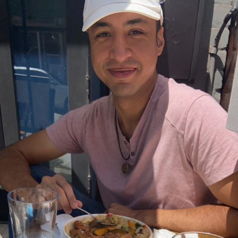
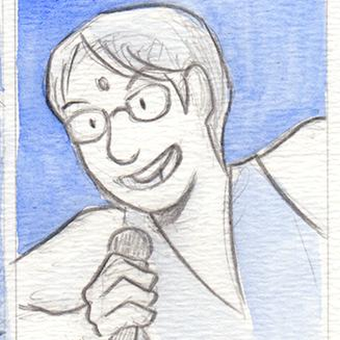
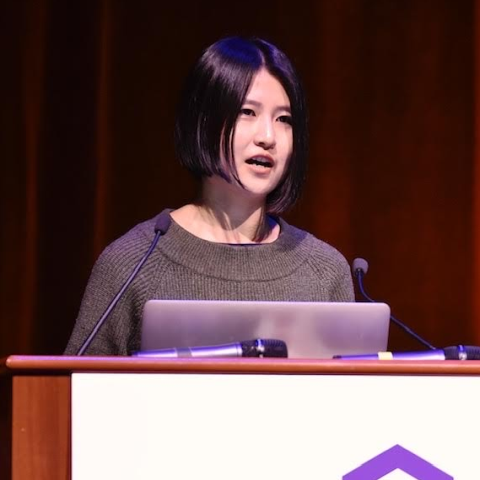

# Speakers and Workshop Leaders

We will continue to update details as we hear back from our presenters.

### Aki Van Ness
 

**Taperipper or, Oops! All SCSI!**

One catgirls venture from a neat idea down the rabbit hole of a not-so legacy protocol, learning more than she bargained for, all in the quest for a joke.

**Aki** is a low-level developer with a primary focus on C++ but she is interested in the whole stack, from software to silicon and does hardware design and electrical engineering in her free time.

 

---

### Aniyia Williams

**Building A Better Tech Future!!**

Today's dominant tech companies were built on values of equality and
empowerment that don't ring true anymore. There is a new technology
ecosystem trying to emerge, fueled by the fault lines exposed in the mainstream
industry, and it needs active nurturing to reach its full potential. In this
talk, Aniyia shares 5 rules for building the future along with some questions
to consider as we shape new ecosystems and economies.

**Aniyia Williams** is a systempreneur, creator, inventor, tech changemaker, and investor. She is a principal on the Responsible Technology team at Omidyar Network, empowering people to help the tech world live up to its promise of changing lives for the better. Aniyia is also co-founder of Zebras Unite, founder and board chair of Black & Brown Founders, co-convener of the Black Innovation Alliance, and previously founded the fashion tech company Tinsel.

 

---

### Anjana Vakil

**La-La-Lambda Calculus: A Functional Musical Journey!**

The lambda calculus is a logical formalism that lets us represent programs - all their logic and data - as nothing but pure, anonymous, single-parameter functions.  Numbers, operators, booleans, control flow, data structures… any way you want it, lambda functions can do it! In this musical talk we’ll sing the praises of the lambda as we take a quirky, nerdy journey toward a deeper understanding & admiration of the computational power of this elegant, powerful abstraction at the heart of functional programming.

**Anjana** suffers from a chronic case of curiosity, which led her from philosophy to English teaching to computational linguistics to software development. As an engineer & educator, these days she mostly codes & teaches from her home base in San Francisco, when not traveling (in a mask) to events around the world to speak about the joy of programming and advocate for a more equitable & ethical tech industry. Nerd out with her about functional programming & JavaScript, ask her about the Recurse Center & Outreachy, and definitely invite her to your karaoke party!

 

---

### Anuoluwapo Karounwi

**Let’s code in our mother tongue!**

The story behind the design and implementation of an African native language-based programming language.

I am an android engineer with 5 years of experience building applications serving over a million users across various industries. As an engineer I am driven by impact and I care deeply about how my work affects users. When I'm not hanging around my computer keyboard, I enjoy spending some time on my piano keyboard. I love keyboards in any form.

 

---

### Ashlee Boyer

**Code readability isn’t just about personal preference!**

Accessibility for developers isn’t often mentioned when we talk about writing code. Code style is one accessibility topic that is unfortunately mischaracterized as personal preference most of the time. Let’s prove that wrong and talk about the accessibility accommodations nearly all developers use every time they code.

**Ashlee** is a Disabled and Neurodivergent software engineer and web accessibility expert. She loves to knit, read, write, and spend time with her family of 2 rescued pitbulls (Trooper and Tango) and life partner (Zach). She has worked with React for several years, and currently works with Next.js as a Web Engineer at HashiCorp. Since October of 2021, she has been a member of the team building HashiCorp Developer. Her primary focus is building accessible and performant user interfaces. At a team level, she also works to establish and maintain accessible experiences for engineers. As a firm believer of "progress over perfection", she strives to make learning about accessibility easier for everyone.

 

---

### Char Stiles (Workshop Leader)

**Char's Shader Workshop**

In this workshop, you will learn how to livecode shaders by creating a visual composition with GPU code and a little bit of math. Livecoding is where changes to the code are realized immediately and rendered in real-time. This is an ideal way to create music visualizers, or any interactive abstract graphics of the sort. We will briefly go over how to use the shaders we create in a variety of other real-time engines like Unity, p5.js & touch designer.

You will learn about where the shader exists in the graphics pipeline, the basics of how the language works, and how to quickly iterate on writing your shader using livecoding tools. You will also be given a plethora of tools to build upon what you learn, so you can keep learning and practicing beyond this workshop. Programming experience required to attend. We suggest you set up two screens so you can code along while watching/participating in the workshop.

**Char Stiles** is an artist, educator and programmer based in Brooklyn, NY. Char works and collaborates across mediums such as interactive installation, video, performance and web. She is a part of the Livecode.nyc collective, where she organizes shows, and livecodes music and visuals. She also is a founder of Hex House, an artist studio &amp; event space for unconventional computing, pleasure studies, and cerebral play.
 
 

---

### Chipzel (Workshop Leader)

**Chipzel** is a musician from Northern Ireland!  She is best known for making chiptune music, particularly with a Game Boy. She is also a video game music composer, and is known for the soundtracks of games such as Super Hexagon, Interstellaria, and Dicey Dungeons. Her music is also featured in other games such as Just Shapes and Beats and Spectra.

---

### Denise Yu (Workshop Leader)

**PLIBMTTBHGATY**

PLIBMTTBHGATY (Programming Languages I’ve Been Meaning To Try But Haven’t Gotten Around To Yet) is a lightly-structured party where people get together and work on a project in a new programming language, either with or just near each other. It was invented by Star Simpson, who has kindly given us permission to run one at !!Con this year!

This all started with the realization that plenty of people have a side-project in mind to work on, that it's more fun to work together, and that many of us are just waiting for a good excuse to get started.

 

---

### Marlene Mhangami

**Shhh, Meet Me at Midnight!!! (Audio Steganography in Python)**

The term 'Audio Steganography' is derived from the Greek words steganos, meaning “covered,” and graphein, meaning “to write”. It refers to the art of enabling secret communication that uses interesting methods to hide information in plain sight. In this talk we'll walk through how to send secret messages in music or audio recordings using Python! We'll understand how computers store things as bytes and how knowing this can lead you to possibly win over the love of your life. 

**Marlene** is a Zimbabwean software engineer, explorer, and speaker based in the city of Harare. She is a director and vice-chair for the Python Software Foundation and is currently working as a Developer Advocate at Voltron Data. In 2017, she co-founded ZimboPy, a non-profit organization that gives Zimbabwean young women access to resources in the field of technology. She is also the previous chair of PyCon Africa and is an advocate for women in tech on the continent.

 

---

### Nicole He

**You Kiss Your Computer With That Mouth?!**

This is a talk about talking - to your computer, out loud, with your mouth, and why a game in this format feels emotionally like an old school exploration RPG.

**Nicole He** is a game developer and creative technologist based in Brooklyn, making unconventional voice technology projects and videogames. She previously worked as a creative technologist at Google Creative Lab and an outreach lead at Kickstarter, and currently teaches at NYU ITP.

 

---

### Omar Rizwan

**How to look for one image inside another image, fast!**

You know about regular expressions and string matching? Well, what about image matching? How would you look for images inside other images? One way that you might do it is to loop through each position in image A and at each of those positions, check how much the area around it looks like image B, so you can build a 'heat map' of which regions of image A look like image B. But that's really slow if image B is more than a few pixels big, since you need to do (number of pixels in A) * (number of pixels in B) iterations...

I was trying to do this for a new project/interface experiment -- a daemon that continuously watches your screen for image patterns that you tell it to look for -- and I found out that this task is called *template matching*, and you can do it way faster. The OpenCV library can do this all in tens of milliseconds, as opposed to the several seconds that the nested-loop approach took for me. So I wanted to know how OpenCV does it, and how I could get rid of the dependency and do it myself!

We'll talk about Apple's Accelerate library, convolution, the Fourier transform, summed-area tables, and why you need to use doubles sometimes instead of floats, among other things. In the end, I got to make the same jump, from seconds down to milliseconds (arguably, I'm even faster than OpenCV now, at least for what i want to do!) -- and the whole thing is basically one self-contained C file.

**Omar** is interested in new ways to interact with (and program) computers. He previously worked as a researcher at Dynamicland; he's also the creator of TabFS, Screenotate, Breakout-in-a-PDF, and a variety of other strange computer projects.

 

---

### Sumana Harihareswara

**Sumana Harihareswara** is an open source contributor and leader who has contributed to pip, GNOME, MediaWiki, Dreamwidth, GNU Mailman, and other open source projects -- and is working on a book to teach what she's learned along the way. She has keynoted LibrePlanet and other open source conventions, spoken at PyCon and OSCON, performed standup comedy and theater at several tech conferences, and manages and maintains open source projects as Changeset Consulting.  Her work has earned her an Open Source Citizen Award and a Google Open Source Peer Bonus. She lives in New York City and microblogs in the Fediverse and on Twitter.

 

---

### Wenting Zhang

**Customizable Icons With Font Technologies!**

With the latest development in variable fonts, typography is getting enriched, and so is iconography! In this talk, Wenting, co-founder of typogram.co, will share new ways to utilize variable font technology for icons — to make icons customizable! The variable font axes can be used as customization sliders. With that, icons as font glyphs can go through a series of transformations based on parameter inputs, therefore editable or customizable.

**Wenting Zhang** is co-founder and CEO of typogram.co — a design software startup. Previously she worked at Adobe, and her projects there include Adobe XD, Illustrator on iPad, and Fonts. Wenting teaches Interaction Design at the School of Visual Arts. Wenting has given speeches at conferences in Paris, New York, Guangzhou, and Shanghai. She journals about her entrepreneurship journey in her weekly newsletter.

 

---

Perhaps you would also be interested in our 
[2021](2021/speakers.html), 
[2020](2020/speakers.html), 
[2019](2019/speakers.html), 
[2018](2018/speakers.html), 
[2017](2017/speakers.html), 
[2016](2016/speakers.html), 
[2015](../2015/speakers.html), 
or [2014](../2014/speakers.html) speakers?
