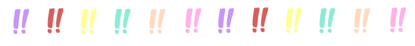

# Code of Conduct

Below, you’ll find the Code of Conduct for Exclamation Foundation events --
for now, these are !!Con and !!Con West.  Our Code of Conduct is a little
different than most: where many Codes of Conduct start and stop at
preventing harassment, ours is **part of an intentional effort to define the
culture of !!Con events**.  We don’t think that !!Con is something that you
passively participate in: everyone who attends **helps construct !!Con** and,
ideally, makes it a better conference.

!!Con is about the joy, excitement, and surprise of computing.  That can’t
exist while excluding people who have been traditionally marginalized in the
computing community, so an intentional part of the culture that we want to
set is for you to feel welcome.  Our purpose in this Code of Conduct is to
give all of our attendees some ideas for how to make all of the above
happen.

<picture><source srcset="images/conduct/how-to-be.webp" type="image/webp"></picture>

## How to be !!Con

**Harassment has no place at !!Con.**  This sounds obvious, but it’s
important.  There are almost limitless ways to harass people; an incomplete
list might include harassment based on gender, sexual orientation,
disability, physical appearance, body size, skin color, or religion, as well
as making predatory sexual advances on other attendees.  Don’t do any of
those things, and in any event, please be mindful of how you talk to and
about other people at the conference.  “Jokes” (or serious actions, for
that matter) that serve to exclude people aren’t okay, either.

Conversely, try to make an extra effort to **be kind and empathetic in how you
act**.  Here’s a few ways you can do that:

* **Read pronoun badges!**  It’s impossible to know what pronouns somebody
  uses just by looking at them.  Let them tell you.

* **Write your pronoun badge!** Even if you think your pronouns are
  “obvious” by looking at you, you should write yours down, too!  (In
  the !!Con Online world, we put the pronouns that we'd rather be called by
  in our Discord name tags, but when we return to in-person !!Cons, we offer
  space on badges to write down preferred pronouns!)

* **Assume that all your fellow conference-goers are technical!**  No matter
  whether people do or don’t look like someone that you often see at a
  conference, everybody at !!Con is here for the love of computing.

* **Let marginalized folks choose how much they want to share about
  themselves!**  It can be tempting to ask somebody about their background,
  based on something about them that you can see or hear.  They might want
  to talk about themselves, but maybe they just want to enjoy technology --
  let them choose!

* **Read up on the Recurse Center social rules!**  The Recurse Center has four social rules:
  **“no feigning surprise”, “no well-actuallys”, “no backseat driving”, and
  “no subtle -isms”**.  Although !!Con isn’t a part of RC, we were
  founded by people who met at RC, and we found that their rules contribute enormously to a
  supportive, productive, and fun learning environment.  If you haven’t
  heard of those before, we encourage you to [read the
  rules](https://www.recurse.com/manual#sub-sec-social-rules); they’re a
  great way to add an extra dose of empathy to your time at !!Con (and maybe
  even beyond!).

A particularly kind way of interacting with your fellow attendees is to
**respect their boundaries**.  If somebody asks you to stop doing something, or
tells you that you’re doing something that makes them uncomfortable, **just
stop doing it**.  Even if you think that what you’re doing is reasonable, it’s
better to be cautious and respectful.

Above all else, remember that !!Con attendees are all here to relish in the
joy, excitement, and surprise of computing.  These guidelines help us all
create a space where that can happen.

<picture><source srcset="images/conduct/bangbang-dashes.webp" type="image/webp"></picture>

## How we handle Code of Conduct issues

In the past, we’ve resolved many of our Code of Conduct reports in a
collaborative fashion.  Often, we find that there’s something to learn, and
ways that the whole community can grow in response!  (We’ve written about
some of these in [our past transparency reports](#transparency-reports).)

But **we want you to know that we have your back**, and so we encourage you
to get an event organizer involved if you’d like some help (more information
on [how to do that below](#getting-in-touch)).  Our policy is that we do not
tell the subject of a Code of Conduct concern who brought the matter to our
attention.

We hope it doesn’t come to this, but at our discretion, **we will ask
attendees who harm the !!Con community to leave**.  This Code of Conduct is
a guide, and since we can’t possibly write down all the ways you can hurt
people, we may ask attendees to leave for reasons that we didn’t write down
explicitly here.  On the other hand, where it’s appropriate, we want to be
forgiving, too: if it seems like you’ve made a good-natured mistake, we want
to give you space to grow and learn!

This Code of Conduct applies not just in “official” !!Con-sponsored spaces,
but also in spaces adjacent to the conference.  If you have a concern about
something that happens outside of the !!Con conference room, it’s OK to
bring it to the organizers.  And, although we explicitly called out
attendees above, this Code of Conduct applies to everybody who contributes
to the !!Con space, including attendees, organizers, sponsors, volunteers,
staff, and Exclamation Foundation board members.

<picture><source srcset="images/conduct/speaker.webp" type="image/webp"></picture>

## Guidelines for speakers

If you’re a speaker -- thank you!  We’ve been really lucky to have speakers
who give thoughtful and exciting talks that are almost always inclusive of
the people in the !!Con audience.

Here are a few guidelines you can use to help make your talk even more
welcoming to everyone in the !!Con community:

* **Give people a heads up if you're discussing sensitive topics.**  If your
  talk includes descriptions of hurtful experiences that attendees might
  share, let us know about it!  Some of these include transphobic,
  homophobic, sexually-motivated, racially-motivated, or
  religiously-motivated abuse and harassment; sexual assault; eating
  disorders; mental illness and self-harm; or relationship abuse.  It's not
  possible to give a full list, but these are some examples of things that
  we hope you'll be sensitive of.  If you expect to cover these topics, **talk
  to the !!Con organizers before the conference** so that we can let attendees
  know these topics will be covered in your talk.  If you want to discuss a
  sensitive topic in your talk and you'd like help approaching it, let us
  know and we'll be happy to brainstorm with you.

* **Avoid unnecessarily violent and sexual imagery.**  Sometimes, including
  these is unavoidable, or is central to the point of the talk, and that's
  okay.  But sometimes, the imagery isn't necessary.  This can be in overt
  ways (for example sexual images) or in more subtle ways (like an indirect
  sexual reference used as a joke).  So before your talk, take one more look
  over your slides and prep material in this light -- and if you explicitly
  plan to include sexual or violent content, consider how you can
  contextualize it.  (If you plan to include
  *graphically* violent content, please do let us know in advance.)

* **Talk to the experts.**  !!Con thrives at the intersection of computers
  and the human experience.  Many of us have become experts in technologies
  just by reading about them, but this doesn't always work when real people
  become involved!  If you plan to include anecdotes about the experiences
  of a minority group you're not a member of in your talk, make sure you've
  spoken with someone from that group first.  They can help guide you on
  what language would accurately capture their experience, and how to do it
  with sensitivity.

Often, talks won't need to make any changes at all to address these!  But
even if your talk is mostly about computers, taking 10 minutes to go through
it and look for some of these issues (even if they're subtle!) goes a long
way to keeping !!Con welcoming for everyone.

<picture><source srcset="images/conduct/contact.webp" type="image/webp"></picture>

## Getting in touch

**If you notice behavior that feels out-of-place at !!Con -- you’re being
harassed, you see someone else being harassed, or something just makes you
uncomfortable -- please contact a member of conference staff.**  Even if you
don’t think that disciplinary action is needed, we want to keep tabs on how
we can build a better conference, so please feel free to reach out to us.

If you have any questions about any part of this Code of Conduct, or about
the Recurse Center social rules, please feel free to reach out to the
conference organizers, or to the [Exclamation Foundation
board](mailto:board@exclamation.foundation).

<!-- TODO: You can use the below form to contact us, with or without your
name.  Or, --> If you'd like to contact us, you can send e-mail to
[2021-organizers@exclamation.foundation](mailto:2021-organizers@exclamation.foundation),
or simply talk to any individual organizer.  We want you to feel safe during
the conference, and we’ll do what we can to make that happen -- you matter
to us!

<!-- NOT FOR ONLINE !!CONS

## Venue

Our gracious hosts request that you please keep your shoes on, do not sit on
credenzas or any furniture that is not a chair/couch, do not run, do not move
furniture without permission, including desks, and please discard your trash in
the closest receptacle. We want to make sure that we leave the venue clean and
respect the space that we're in.

-->

<picture><source srcset="images/conduct/dashes.webp" type="image/webp"></picture>

## Transparency reports

!!Con's Code of Conduct committees have compiled transparency reports for
reported incidents in previous years, which you can find below:

* [!!Con West 2020](http://bangbangcon.com/west/conduct-transparency/)
* [!!Con West 2019](http://bangbangcon.com/west/2019/conduct-transparency/)

## Thanks

The Exclamation Foundation Code of Conduct was illustrated by [Annie Ruygt](https://annieruygtillustration.com/).

<!-- ## Transparency reports

!!Con's Code of Conduct committee has compiled a [transparency
report](/2019/conduct-transparency) for reported incidents in 2019. -->

<!-- TODO
## Report a violation (with or without your name)
-->

<!-- TODO: generalize this to the !F Code of Conduct

TODO: Do we actually want to make this cc0?  Consider:

https://modelviewculture.com/pieces/a-code-of-conduct-is-not-enough

## License

The !!Con Code of Conduct is under a [Creative Commons
Zero](http://creativecommons.org/about/cc0) license.

-->