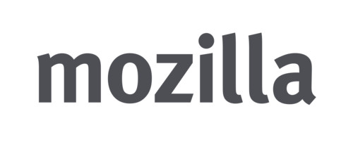
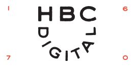
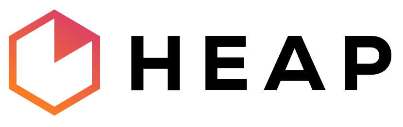

  **Quick Links:**
  <!-- [Talk Recordings](recordings.html) -->
  <!-- &middot; -->
  [Venue](venue-accessibility.html)
  &middot;
  <!-- [Program](program.html) -->
  <!-- &middot; -->
  [Speakers](speakers.html)
  &middot;
  [Conduct](conduct.html)

**!!Con** (pronounced "bang bang con") is **two days of
ten-minute talks** (with lots of breaks, of course!) to celebrate the
joyous, exciting, and surprising moments in computing.  Join us for
our **fourth year** in 2017!

## Who's speaking?

Our amazing keynote speakers...

<h3>Karen Sandler</h3>

<h3>Limor Fried</h3>

... and more! Our [call for talk proposals](give-a-talk.html)
is closed. Speakers will be notified of acceptance by April 6th!

## Where and when?

!!Con will be held at the [AppNexus](http://appnexus.com) headquarters
at 28 West 23rd Street, 4th floor, Manhattan, NYC, on the weekend of
May 6-7, 2017.
[Learn more about our venue!](venue-accessibility.html)

## How much does it cost?  Where do I register?

!!Con is a *pay-what-you-want* conference.  Stay tuned for
  registration information!

## What's so great about !!Con?

Here's what some of our 2016 speakers and attendees said about us:

> "**a non-stop barrage of AWESOME talks!**" --
> [@AnjanaVakil](https://twitter.com/AnjanaVakil/status/729061608140509185)

> "**one of the most diverse and engaged tech communities** I've ever
> encountered" --
> [@enjenneer](https://twitter.com/enjenneer/status/729866321001844737)

> "What an **amazing, delightful, intellectually stimulating, and
> simply joyous** conference!" --
> [@techstepper](https://twitter.com/techstepper/status/729503996730347520)

> "#bangbangcon was **utterly amazing**, to the point that i have not
> tweeted about it because how do you fit that into a tweet" --
> [@jackmakesthings](https://twitter.com/jackmakesthings/status/729694660407504897)

> "**if you are not making plans to attend** next year's @bangbangcon,
> you are **making a huge mistake**" --
> [@tdenkinger](https://twitter.com/tdenkinger/status/729554572843323392)

> "This weekend #bangbangcon showed me **a world I want to live in all
> the time**" --
> [@nathanstilwell](https://twitter.com/nathanstilwell/status/729442220156276741)

> "**If I never went to another tech conference, this would be the one
> to have ended on**"
> -- [@aredridel](https://twitter.com/aredridel/status/729460621775867904)

With your help, we plan to make !!Con 2017 at least as good!

## How do I get updates?

For updates on !!Con, follow
[@bangbangcon](https://twitter.com/bangbangcon) on Twitter, or sign up
for our mailing list below! No spam, we promise!

<!-- Begin MailChimp Signup Form -->

<form action="http://bangbangcon.us3.list-manage.com/subscribe/post?u=37b924b9d7d71dc7aa1a52b4c&amp;id=9f9ec7c469" method="post" id="mc-embedded-subscribe-form" name="mc-embedded-subscribe-form" class="validate" target="_blank" style="background-color: inherit;" novalidate>

<label for="mce-EMAIL">Email:</label>
<input type="email" value="" name="EMAIL" class="required email" id="mce-EMAIL" placeholder='your email address'>
<input type="submit" value="Subscribe" name="subscribe" id="mc-embedded-subscribe" class="button">

<!-- real people should not fill this in and expect good things - do not remove this or risk form bot signups-->

<input type="text" name="b_37b924b9d7d71dc7aa1a52b4c_9f9ec7c469" value="">

</form>

## Who's organizing all this?

The !!Con 2017 organizing team:
[Danielle Sucher](https://twitter.com/DanielleSucher),
[Erty Seidohl](https://twitter.com/ertyseidohl),
[Julia Evans](https://twitter.com/b0rk),
[Kiran Bhattaram](https://twitter.com/kiranbot),
[Lindsey Kuper](https://twitter.com/lindsey), and
[Nabil Hassein](https://twitter.com/NabilHassein).  Organizers
emeriti: [Alex Clemmer](https://twitter.com/hausdorff_space),
[Leo Franchi](https://twitter.com/lfranchi), and
[Maggie Zhou](https://twitter.com/zmagg).  Logo design by
[Lea Albaugh](http://twitter.com/doridoidea).

## Sponsors

Thank you to our amazing sponsors for helping make !!Con possible!

    <h3>PHENOMENAL!!! Sponsors</h3>

    
<a href="https://appnexus.com" target="_blank">.

</a>

    
<a href="https://comcast.com" target="_blank">.

</a>

    <h3>AWESOME! Sponsors</h3>

    
<a href="http://raise.com" target="_blank">.

</a>

    
<a href="http://stripe.com/jobs" target="_blank">.

</a>

    
<a href="http://soundcloud.com" target="_blank">.

</a>

    
<a href="http://mozilla.com" target="_blank">.

</a>

    

.

    
<a href="http://heapanalytics.com/jobs" target="_blank">.

</a>

    
<a href="http://meetup.com" target="_blank">.

</a>

## How can I help?

We're looking for companies to sponsor us!  Check out our
[sponsorship page](sponsors.html) to learn more.

## Code of Conduct

We have a [code of conduct](conduct.html) that all !!Con participants
are required to observe.

