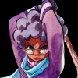
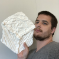
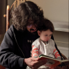
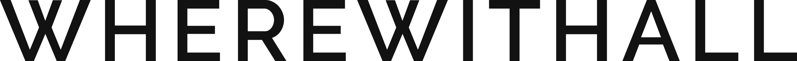
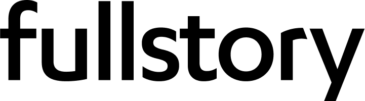
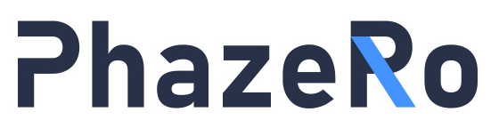

  **Quick Links:**
  &middot;
  [Schedule](program.html)  
  &middot;
  [Tickets](tickets.html)
  &middot;
  [Speakers](speakers.html)
  &middot;
  [Conduct](conduct.html)
  &middot;
  [Past Recordings](recordings.html)

**!!Con** (pronounced "bang bang con") **2021** is **a week of
ten-minute talks** (with lots of breaks, of course!) to celebrate the
joyous, exciting, and surprising moments in computing.

  

  

<!-- 

) -->
<!-- 

 -->
<!-- 

 -->
  

  

  

  

  

  

  

  

## Who's speaking?

Our [call for talk](give-a-talk.html) proposals is closed. Thanks for
all your wonderful talk proposal submissions! Learn more about our amazing [speakers](speakers.html)!

## Where and when?

!!Con 2021 will be held online, the week of May 15-22, 2021!!

!!Con is a *pay-what-you-want* conference. Our registration will open April 24th (first batch) and April 26th (second batch).

## What's so great about !!Con?

Here's what some of our past speakers and attendees said about us:

> "@bangbangcon managed to pack **more useful info into one day than most other conferences do in 3**. And it was **10x more fun.**"
> -- [@johnwittrock](https://twitter.com/johnwittrock/status/861206986448404481)
>
> "Virtual @bangbangcon's reminding me **how much fun it is to hear people
> talk about what they're passionate about**"
> -- [@trudake](https://twitter.com/trudake/status/1259231865212481537)
>
> "It's refreshing to **learn 30+ new things about programming in a single weekend** at @bangbangcon, even though I've been programming for so long"
> -- [@pixelyunicorn](https://twitter.com/pixelyunicorn/status/861690031370645504)
>
> "@bangbangcon was awesome!  Learned a lot, met very friendly people, and **left inspired**."
> -- [@bxmani](https://twitter.com/bxmani/status/861400448107937792)
>
> "It's only halfway over, but **@bangbangcon is setting the bar for virtual
> events for me**.  [...]"
> -- [@lazerwalker](https://twitter.com/lazerwalker/status/1259238259328237568)

We hope !!Con 2021 will be at least as good!

## How do I get updates?

For updates on !!Con, follow
[@bangbangcon](https://twitter.com/bangbangcon) on Twitter, or sign up
for our mailing list below.  We send about four or five emails per year for important announcements about our venue, submission deadlines, registration, and that sort of thing.  No spam, we promise, and it's easy to unsubscribe at any time.

<!-- Begin MailChimp Signup Form -->

<form action="http://bangbangcon.us3.list-manage.com/subscribe/post?u=37b924b9d7d71dc7aa1a52b4c&amp;id=9f9ec7c469" method="post" id="mc-embedded-subscribe-form" name="mc-embedded-subscribe-form" class="validate" target="_blank" style="background-color: inherit;" novalidate>

<label for="mce-EMAIL">Email:</label>
<input type="email" value="" name="EMAIL" class="required email" id="mce-EMAIL" placeholder='your email address'>
<input type="submit" value="Subscribe" name="subscribe" id="mc-embedded-subscribe" class="button">

<!-- real people should not fill this in and expect good things - do not remove this or risk form bot signups-->

<input type="text" name="b_37b924b9d7d71dc7aa1a52b4c_9f9ec7c469" value="">

</form>

## Who's organizing all this?

The !!Con 2021 organizing team:
[Joshua Wise](https://joshuawise.com/),
[Erty Seidohl](https://twitter.com/ertyseidohl),
[Julia Evans](https://twitter.com/b0rk),
[Alicja Raszkowska](https://twitter.com/mamrotynka),
[Sarah Withee](https://twitter.com/geekygirlsarah),
[Dev Purandare](https://twitter.com/Dev14e), and
[Lindsey Kuper](http://composition.al/).  If you'd like, you can [send us
some mail](mailto:2021-organizers@exclamation.foundation)!

Organizers emeriti: [Leo Franchi](https://twitter.com/lfranchi), [Nabil Hassein](https://twitter.com/NabilHassein),
[Maggie Zhou](https://twitter.com/zmagg), [Alex Clemmer](https://twitter.com/hausdorff_space),
[Emily Xie](https://twitter.com/emilyxxie), [Danielle Sucher](https://twitter.com/DanielleSucher), 
[Kiran Bhattaram](https://twitter.com/kiranb), and [Ahmed Abdalla](https://twitter.com/simplyahmaz1ng)

Logo design by
[Lea Albaugh](http://twitter.com/doridoidea).

!!Con 2021 is a project of the [Exclamation
Foundation](http://exclamation.foundation).

## Sponsorship

Is your organization interested in sponsoring !!Con?  Check out our
[sponsorship prospectus](sponsors.html), or directly [get in
touch](mailto:2021-organizers@exclamation.foundation).

  <h3>EXCELLENT!! Sponsors</h3>

  
<a href="https://xandr.com/" target="_blank">.

</a>

  <h3 style="margin: 1.5em 0;">AWESOME! Sponsors</h3>

  
<a href="https://courses.wherewithall.com/pages/bangbangcon" target="_blank">.

</a>

  
<a href="https://discourse.org/" target="_blank">.

</a>

  
<a href="https://bionic.fullstory.com/" target="_blank">.

</a>

  
<a href="https://www.twosigma.com/careers/" target="_blank">.

</a>

    
  
<a href="https://phaze.ro/" target="_blank">.

</a>

## Code of conduct

We have a [code of conduct](conduct.html) that all !!Con participants are required to observe.
