<!--
haha look at you reading the source
you found me
what will you do now???? ?? ? ? ? ??
-->

  **Quick Links:**
  [Venue](venue.html)
  &middot;
  [Give a Talk](give-a-talk.html)
  &middot;
  [Program](program.html)
  &middot;
  [Speakers](speakers.html)
  &middot;
  [Sponsorship](sponsors.html)
  &middot;
  [Conduct](conduct.html)

**Tickets are available for the last-ever !!Con!  Get yours [here](https://bangbangcon2024.ticketspice.com/tickets) before they're all gone!**

**!!Con** (pronounced "bang bang con") **2024** is our _final_ event featuring **two days of talks** to celebrate the
joyous, exciting, and surprising moments in computing.

  

  
<a href="speakers.html#dawn-walker">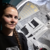</a>

  

  

  

  

  

  
<a href="speakers.html#devon-tao">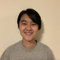</a>

  
<a href="speakers.html#ivan-zhao">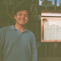</a>

  
<a href="speakers.html#jes-wolfe">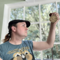</a>

  
<a href="speakers.html#jesse-chen">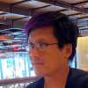</a>

  

  

  

  

  
<a href="speakers.html#matias-lang">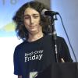</a>

  

  

  

  

  

  
<a href="speakers.html#phil-warren">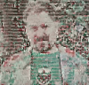</a>

  

  
<a href="speakers.html#richard-lewei-huang-yufeng-zhao">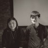</a>

  

  

  

  

  
<a href="speakers.html#yufeng-zhao">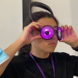</a>

## Save the Dates!

!!Con 2024 will be held on the weekend of August 24-25, [in the courtyard of the Baskin School of Engineering at UC Santa Cruz](venue.html), in Santa Cruz, California, United States! 

It will also be livestreamed!

Check out our [program](program.html)!

## How do I get updates?

For updates on !!Con, follow
[@bangbangcon@mastodon.social](https://mastodon.social/@bangbangcon), or sign up
for our mailing list below.  We send about four or five emails per year for important announcements about our venue, 
submission deadlines, registration, and that sort of thing.  No spam, we promise, and it's easy to unsubscribe at any 
time.

<!-- Begin MailChimp Signup Form -->

<form action="https://bangbangcon.us3.list-manage.com/subscribe/post?u=37b924b9d7d71dc7aa1a52b4c&amp;id=9f9ec7c469" method="post" id="mc-embedded-subscribe-form" name="mc-embedded-subscribe-form" class="validate" target="_blank" style="background-color: inherit;" novalidate>

<label for="mce-EMAIL">Email:</label>
<input type="email" value="" name="EMAIL" class="required email" id="mce-EMAIL" placeholder='your email address'>
<input type="submit" value="Subscribe" name="subscribe" id="mc-embedded-subscribe" class="button">

<!-- real people should not fill this in and expect good things - do not remove this or risk form bot signups-->

<label>"Don't fill this in, it's for bots!"
<input type="text" name="b_37b924b9d7d71dc7aa1a52b4c_9f9ec7c469" value="">
</label>

</form>

## What's so great about !!Con?

Here's what some of our past speakers and attendees said about us:

> "Going to !!Con **rekindled my love of computing and changed my entire career trajectory**. Most fun I've ever had at a tech event!"
> -- [Geoffrey Litt](https://www.geoffreylitt.com/)
>
> "[@bangbangcon managed to pack **more useful info into one day than most other conferences do in 3**. And it was **10x more fun.**"](https://twitter.com/johnwittrock/status/861206986448404481)
> -- John Wittrock
>
> ["It's refreshing to **learn 30+ new things about programming in a single weekend** at @bangbangcon, even though I've been programming for so long"](https://twitter.com/pixelyunicorn/status/861690031370645504)
> -- [Melody Starling](https://melody.dev/)
>
> ["@bangbangcon was awesome!  Learned a lot, met very friendly people, and **left inspired**."](https://twitter.com/bxmani/status/861400448107937792)
> -- [Bomani McClendon](https://bomani.rip/)

## How do I attend?

You can attend !!Con 2024 either [in-person](https://bangbangcon.com/venue.html) or online!

To join us in person, you'll need to have a ticket -- [go get one](https://bangbangcon2024.ticketspice.com/tickets)!  As always for !!Con, tickets are pay-what-you-want. This year, we've set a suggested ticket price of $256 -- it turns out that running an [outdoor conference](https://bangbangcon.com/venue.html) gets really expensive really quickly. If you can, please consider paying $256 for your ticket (or, if you can afford it, more, so that folks who haven't got the means can come and we can still run the event!). But *we want you at the conference regardless*, so if you can't afford $256, please register anyway and pay what you can afford!

We're also offering [online-only tickets](https://bangbangcon2024.ticketspice.com/tickets), with a suggested donation of $8. Buying an online-only ticket will get you access to our 2024 Discord server.  Discord was a popular feature of the online-only !!Cons in [2022](/2022/), [2021](/2021/), and [2020](/2020). (In-person attendees will get access to the Discord too.)

And, as always, our live stream will be public and free for everyone, no ticket required.  Watch this space for details about the live stream!

## Who's sponsoring?

  <h3 style="margin: 1.5em 0;">AWESOME! Sponsors!</h3>

  
<a href="https://buttondown.com/" target="_blank">.

</a>

    
  
<a href="https://accelerated.tech/" target="_blank">.

</a>

	
  <h3 style="margin: 1.5em 0;">Swag Sponsors!</h3>	
  
  
.
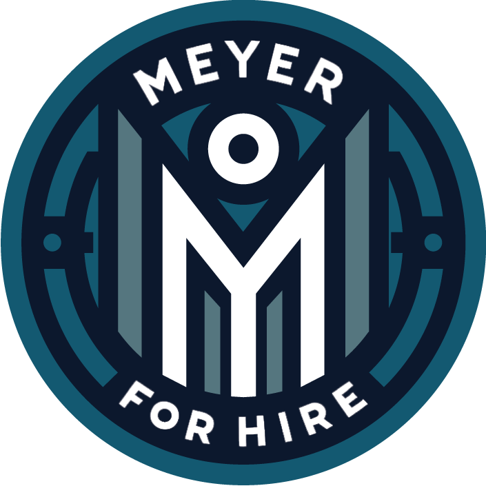

		
	
  
<a href="https://magicbutton.club" target="_blank">.
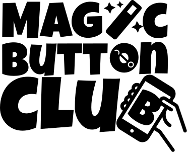
</a>
	
	
  <!-- <h3 style="margin: 1.5em 0;">Live Captioning Sponsor!</h3>  -->
  
  <!-- 
<a href="https://stantonventures.com" target="_blank">
  <!--   class="magic">.

  <!--   alt="Stanton Ventures" src="images/sponsors/stanton-ventures.png" />
</a>
 -->

  <h3 style="margin: 1.5em 0;">Coffee Sponsor!</h3>	
  
  
.
<a href="https://ntietz.com/" target="_blank">
	Nicole Tietz-Sokolskaya</a> 
	is the generous sponsor 
	of our afternoon coffee breaks! ☕ 
	Thank you, Nicole! ❤️

  <h3 style="margin: 1.5em 0;">Venue Sponsor!</h3>	
  
  
<a href="https://engineering.ucsc.edu/" target="_blank">.
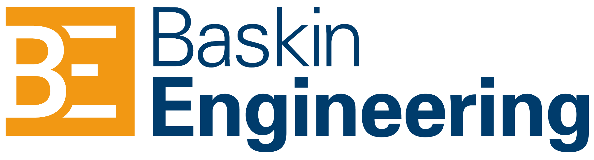
</a>

Special thanks to [John Feminella](http://jxf.me/) for underwriting !!Con 2024! ❤️

Want to sponsor !!Con as an organization or individual?  We're trying to set the standard for a COVID-safe and inclusive conference.  If you can help out, check out our [sponsorship page](sponsors.html) and [get in touch](mailto:2024-organizers@exclamation.foundation)!

## Who's organizing all this?

The !!Con 2024 organizing team:
[Sarah Withee](https://geekygirlsarah.com/links),
[Erty Seidohl](https://erty.me),
[Lindsey Kuper](http://decomposition.al/),
and [Joshua Wise](https://joshuawise.com/).

Special thanks to [Lee Pepper](https://sheerspite.ca/), who has been invaluable in providing administrative help!

If you'd like, you can [send us some mail](mailto:2024-organizers@exclamation.foundation)!

Organizers emeriti: [Julia Evans](https://jvns.ca),
[Em Lazer-Walker](https://twitter.com/lazerwalker),
[Maggie Zhou](https://twitter.com/zmagg), 
[Alicja Raszkowska](https://twitter.com/mamrotynka), 
[Leo Franchi](https://www.instagram.com/lfranchi), 
[Nabil Hassein](https://nabilhassein.github.io),
[Alex Clemmer](https://twitter.com/hausdorff_space),
[Emily Xie](https://twitter.com/emilyxxie), 
[Danielle Sucher](https://www.daniellesucher.com/), 
[Kiran Bhattaram](https://twitter.com/kiranb), 
[Ahmed Abdalla](https://twitter.com/simplyahmaz1ng),
[Dev Purandare](https://sincerely.dev), and
Jeena Lee.

Logo design by
[Lea Albaugh](http://lea.zone/).

!!Con 2024 is a project of the [Exclamation Foundation](https://exclamation.foundation).

## Code of Conduct

We have a [code of conduct](conduct.html) that all !!Con participants are required to observe.
