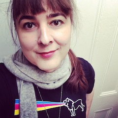

  **Quick Links:**
  &middot;
  [Venue](venue-accessibility.html)
  &middot;
  [Speakers](speakers.html)
  &middot;
  [Program](program.html)
  &middot;
  [Conduct](conduct.html)

**!!Con** (pronounced "bang bang con") **2019** is **two days of
ten-minute talks** (with lots of breaks, of course!) to celebrate the
joyous, exciting, and surprising moments in computing.

    

    

    

    

    

    

    

    

    

    

    

    

    

    

    

    

    

    

    

    

    

    

    

    

    

    

    

    

    

    

    

    

## Who's speaking?

Our [call for talk](give-a-talk.html) proposals is closed. Thanks for
all your wonderful talk proposal submissions!

## Where and when?

!!Con 2019 will be held at the [AppNexus](http://appnexus.com) headquarters
at 28 West 23rd Street, 4th floor, Manhattan, NYC, on the weekend of
May 11-12, 2019.  [Learn more about our venue!](venue-accessibility.html)

!!Con is a *pay-what-you-want* conference.  Registration is [via Eventbrite](https://www.eventbrite.com/e/con-2019-tickets-59589946133#tickets) and is now closed.  Thanks for your interest in !!Con!

## What's so great about !!Con?

Here's what some of our past speakers and attendees said about us:

<!-- Need to update these for 2019 -->

> "We aren't even at lunch yet and already this is **the coolest conference I've ever been to!**"
> -- [@mahtab_sabet](https://twitter.com/mahtab_sabet/status/860876124141780992)
>
> "@bangbangcon managed to pack **more useful info into one day than most other conferences do in 3**. And it was **10x more fun.**"
> -- [@johnwittrock](https://twitter.com/johnwittrock/status/861206986448404481)
>
> "It's refreshing to **learn 30+ new things about programming in a single weekend** at @bangbangcon, even though I've been programming for so long"
> -- [@pixelyunicorn](https://twitter.com/pixelyunicorn/status/861690031370645504)
>
> "@bangbangcon is **the most exciting and important conference in NYC**"
> -- [@aaronmblevin](https://twitter.com/aaronmblevin/status/843949325906534402)
> 
> "@bangbangcon was awesome!  Learned a lot, met very friendly people, and **left inspired**."
> -- [@bxmani](https://twitter.com/bxmani/status/861400448107937792)

We hope !!Con 2019 will be at least as good!

## How do I get updates?

For updates on !!Con, follow
[@bangbangcon](https://twitter.com/bangbangcon) on Twitter, or sign up
for our mailing list below.  We send about four or five emails per year for important announcements about our venue, submission deadlines, registration, and that sort of thing.  No spam, we promise, and it's easy to unsubscribe at any time.

<!-- Begin MailChimp Signup Form -->

<form action="http://bangbangcon.us3.list-manage.com/subscribe/post?u=37b924b9d7d71dc7aa1a52b4c&amp;id=9f9ec7c469" method="post" id="mc-embedded-subscribe-form" name="mc-embedded-subscribe-form" class="validate" target="_blank" style="background-color: inherit;" novalidate>

<label for="mce-EMAIL">Email:</label>
<input type="email" value="" name="EMAIL" class="required email" id="mce-EMAIL" placeholder='your email address'>
<input type="submit" value="Subscribe" name="subscribe" id="mc-embedded-subscribe" class="button">

<!-- real people should not fill this in and expect good things - do not remove this or risk form bot signups-->

<input type="text" name="b_37b924b9d7d71dc7aa1a52b4c_9f9ec7c469" value="">

</form>

## Who's organizing all this?

The !!Con 2019 organizing team:
[Erty Seidohl](https://twitter.com/ertyseidohl),
[Julia Evans](https://twitter.com/b0rk),
[Ahmed Abdalla](https://twitter.com/simplyahmaz1ng),
[Emily Xie](https://twitter.com/emilyxxie), and
[Alicja Raszkowska](https://twitter.com/mamrotynka).  Organizers
emeriti: [Leo Franchi](https://twitter.com/lfranchi), [Nabil Hassein](https://twitter.com/NabilHassein),
[Maggie Zhou](https://twitter.com/zmagg), [Danielle Sucher](https://twitter.com/DanielleSucher), [Alex Clemmer](https://twitter.com/hausdorff_space), [Kiran Bhattaram](https://twitter.com/kiranb), and [Lindsey Kuper](https://twitter.com/lindsey).  Logo design by
[Lea Albaugh](http://twitter.com/doridoidea).

## Sponsorship

Is your organization interested in sponsoring !!Con?  Check out our [sponsorship page](sponsors.html)!

  <h3>PHENOMENAL!!! Sponsors</h3>

  
<a href="https://appnexus.com" target="_blank">.

</a>

  
<a href="https://careers.google.com/teams/" target="_blank">.

</a>

  <h3>EXCELLENT!! Sponsors</h3>

  
<a href="https://www.etsy.com/careers#engineering" target="_blank">.

</a>

  
<a href="https://twilio.com" target="_blank">.

</a>

  <h3>AWESOME! Sponsors</h3>

  
<a href="https://kickstarter.engineering/" target="_blank">.

</a>

  
<a href="https://recurse.com" target="_blank">.

</a>

  
<a href="https://www.twosigma.com/careers/" target="_blank">.

</a>

## Code of conduct

We have a [code of conduct](conduct.html) that all !!Con participants are required to observe.
