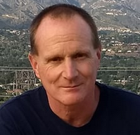
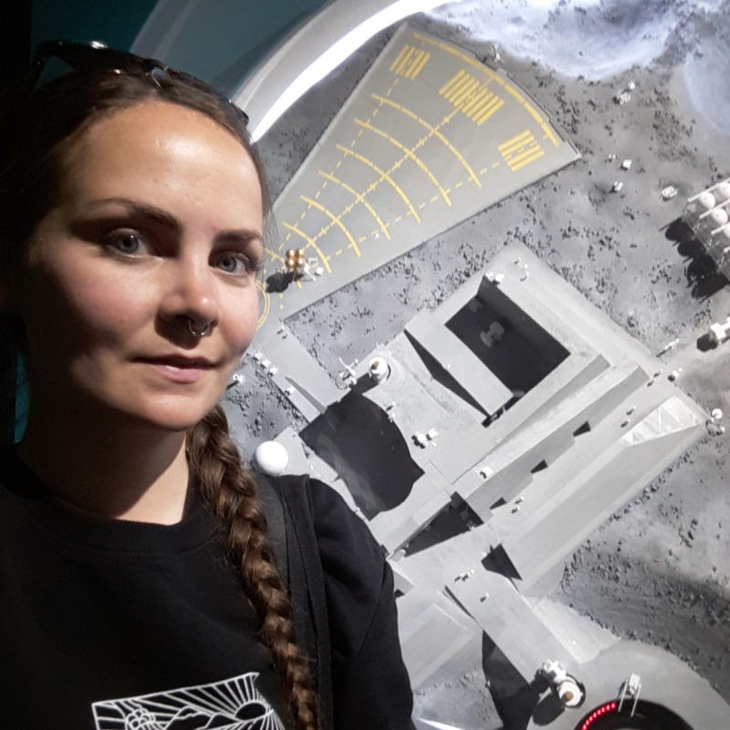
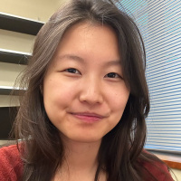
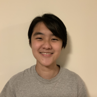
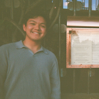
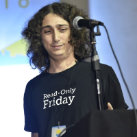
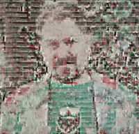
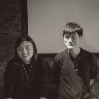
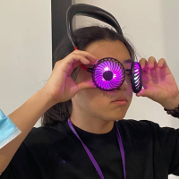

# Speakers

## Keynote Talks

### Bruce Waggoner - Saving Voyager 1!

Both of the 47 year old Voyager spacecraft are currently in interstellar space and returning their most important data set; in-situ measurements of the magnetic field, plasma and dust beyond the Heliopause.   In late 2023, Voyager 1 lost all downlink telemetry and the flight team had essentially no visibility into the state of the spacecraft which is over 15 billion miles from the Earth.   This talk will detail how the flight team diagnosed the problem, and formulated a recovery plan to patch the Flight Data System flight software.

I am the Mission Assurance Manager at NASA Jet Propulsion Lab/Caltech. I graduated from the University of Nebraska with a BS in Physics and Astronomy.  I have worked at JPL for 39 years supporting dozens of Earth orbiting and deep space missions.  I also volunteer as a gymnastics coach and assist teaching girls engineering and science at a local high school.

---

### Dawn Walker

**Dawn Walker** is a researcher and designer interested in how computing intersects with just transitions. She has started a tech worker co-op, participated in community-led archiving of environmental and climate data, and schemed about mesh networking (to name a few things) in her attempts to create alternatives to existing ways of building and stewarding technology. Since 2017 she has co-organized Our Networks, a conference about the past, present, and future of building our own network infrastructures hosted in Toronto and Vancouver.

---

## Lightning Talks

<!-- For easy copy/paste action

-->

### Alicia Guo

**This is the poem that doesn’t end!! or, the poetics of RNG!**

What does it mean for a poem to go on … forever? How does it never run out of possibilities? We’ll be exploring writing through context-free grammars and other random processes asking ourselves, what is randomness anyway? We’ll look at pre-computing forms of random generation to pseudo and true random generation to bananas, expanding our understanding of randomness as a function to something more poetic.

**Alicia Guo is** a computational artist and poet based in Seattle, currently pursuing a PhD working on creativity support tools. Her work plays with blending the physical and digital into love letters on the internet, transforming text into interactive experiences. Her computational poems have appeared in Taper, The HTML Review, and Crawlspace.

---

### Amédée d'Aboville

**Let's run a tiny chess neural network by hand!**

A few years ago an "ultralearner" tried to learn chess _in a month_ and then play world champion Magnus Carlsen. He had the wild idea of hand running a neural network on a piece of paper during the game! This probably isn't physically possible (...he didn't win), but what's the closest we could get? This made me curious: what's the smallest neural network you could make that could be helpful for a human?  What if you only had pen and paper (and maybe a lot of time), or if you had a calculator? We’ll go over the smallest possible neural nets for chess. In the era of mega NNs these will be refreshingly tiny!

**Amédée** is a full stack software engineer from Montréal (now moving to Amsterdam!). They like growing culinary mushrooms, playing chess, and techno music.

---

### Devon Tao

**It's alive.... IT'S ALIVE!!! Braitenberg Vehicles! (Have you ever seen an AI like this??!!)**

"AI has been getting more and more complex. Surrounded by chess robots, self-driving cars, and now Large Language Models, we begin to ask ourselves: what does it take for a machine to behave like a human? Does it take millions of parameters? Mountains of training data?

None of the above! Introducing... Braitenberg Vehicles! These are simple, human-like robots that are made only of a couple of sensors and motors. In this talk, I will convince you that these simple components are enough to show human-like behavior, and we will get to see some Braitenberg Vehicles in action using a Braitenberg Vehicles Simulator I made!"

**Devon** is a student at Harvey Mudd College studying computer science and mathematics. Outside of computer science, they also like to write musical theater!

---

### Ivan Zhao

**Making Chinese Typefaces! with Components!!??!!**

Are you stuck finding a great chinese typeface for you to use? Scared to find something that might get twitter in a fight over? This talk will teach you the basics of Chinese type systems, how to use them, and why computing and component based architecture can dramatically reduce the amount of time it takes for you to make an 8,000 character font.

**Ivan Zhao** (he/him) is a poet, game & type designer, and web artist interested in nonlinear narratives, forms, and mechanics that reckon with digital, diasporic, and queer identity. His work interrogates individual and viewer agency.

---

### Jes Wolfe

**The Astrolabe! Using modern digital computing to recreate ancient analog computers**

For fifteen hundred years, the astrolabe was the most widely-used computing device on earth, sometimes called “the original smartphone”. They were traditionally made by hand, but I had to find out: how hard would it be to design and make one using only digital design and computer-controlled fabrication methods?

**Jes Wolfe** is a software developer and payments engineer in Portland Oregon, whose code has almost certainly handled some of your money at some point. They spend their free time misusing technology, doing space math for astrologers, and helping their six-year-old invent new integer sequences.

---

### Juan Pablo Sarmiento

**Calculating the Ideal "Sex and the City" Polycule!**

Sex and the City, the iconic early 2000s show, depicted social life, sex, and relationships through a lens rarely seen at that time that shook society to its core. But this cultural phenomenon had one fatal flaw: it was based on the assumption that each protagonist could only end up with *one* person. I couldn't help but wonder... what if each person could be in an ethically and consenting relationship with more than one person at a time? What would the ideal polycule be? How do we even calculate that? What would the math look like? These are the questions society needs to be asking! These are the real problems VCs should be investing in! Dare I say, if we put a man on the moon we can settle once and for all who Carrie *actually* should have ended up with. It's time to disrupt polyamory.

**Pablo** is a full stack engineer, specializing in building software for humanitarian emergencies. In his spare time he enjoys contemplating hypothetical endings to TV shows and working out the answers to questions that should have never been asked.

---

### Julian Squires

**Backtraces in the Mirror: Stealing the Secrets of Elves and Dwarves to Perform Mad Science!!**

While writing an unobtrusive memory profiler, I discovered I needed to reconstruct a running program's stack the wrong way around! I thought this was impossible, and it turns out I was wrong! So join me to learn about how stack unwinding works (and when it doesn't!), how to use ELF and DWARF information all wrong(!), working with uncertain information (and why!), and the value of doing things that "can't possibly work"!!

**Julian Squires** is a lifelong programmer and eccentric layabout. He previously spoke at !!Con 2017 about "the Emoji that Killed Chrome" (!!).

---

### Maryanne Wachter

**Riveting Insights! Bridge.watch and the State of America's Infrastructure**

There are over 600,000 bridges in the U.S. with nearly 4 billion daily crossings. While the (fortunately rare) bridge collapse will make national news, what other publicly available information is there that we can dig into the state of U.S. infrastructure? This talk will go over the development of an open source application, [project name], for processing, cleaning, and visualizing bridge infrastructure data from the FHWA and what insights can be gained through simple queries and generating different visuals on the fly.

**Maryanne Wachter** is a software developer and professional engineer. As a structural engineer, she's worked on landmark transit projects, long-span bridges, and various educational/cultural centers in the U.S. and Europe. She currently works as a senior software engineer at Ready.net specializing in geospatial data visualization.

---

### Matías Lang

**It wasn’t me, it was the cosmic rays! Blaming physics for our evil actions!**

As we know from Murphy, everything that can go wrong will go wrong. Sometimes, a single particle close to your computer's memory will turn a 0 into 1 or vice-versa. There exist lots of examples of real-life bugs caused by this effect. Since bit-flips do occur in our devices, this means nobody can blame us if suddenly a single bit from an executable file changes! It could've been a random cosmic ray that caused the damage! In this talk, we can see how this plausible deniability comes handy to attackers: they might create sophisticated supply-chain attacks or gain persistent access to systems, just with a single bit-flip that can be explained by a physical phenomenon!

**Matías** is an Argentinian security researcher and developer. He believes someday engineers will have the right tools and knowledge to build truly secure software. Since that hasn't occurred yet, he refuses to use many applications until their security holes get fixed.

---

### Nicole Tietz-Sokolskaya

**Programming with only exceptions!**

We're used to programming with a lot of control flow constructs, but some languages (👀 Python...) use exceptions for control flow. What if that was *all* we had? Nicole made the poor decision to find out, and created Hurl! She will discuss what programming looks like when we eschew normal control flow, how to implement normal-feeling control flow, and some of the limitations of the existing Hurl implementation.

**Nicole** is a Principal Software Engineer at Remesh, where she focuses on software architecture, performance, scalability, and security. Outside of work, she plays with her kids, spends too much time on computers, hangs out at the Recurse Center, and drinks tons of decaf coffee.

---

### Nolen Royalty

**88 Files a Second - Running Flappy Bird inside MacOS Finder!**

MacOS's Finder is designed for browsing files - but it's powerful enough to run Flappy Bird. Kind of. In this talk I'll cover how to get Flappy Bird running at 4 frames (and 88 files) a second in Finder - complete with a full game loop, high score tracking, and marquee banner ads. I'll start with a barely sub-1-frame-a-second prototype and walk you through the hacks I needed to productionize the game, such as: 

* Simulating a "button" inside the filesystem via a Finder-specific "last opened" timestamp 
* Symlinking 44 files to their parent directories 
* Stuffing emojis into filenames 
* Implementing double buffering inside a Finder window via bizarre AppleScript incantations 

You'll hopefully leave with a newfound appreciation for the power of Finder and AppleScript and a better understanding of why double buffering is important for a smooth gaming experience.

**Nolen Royalty** loves embedding games in surprising places and building experiences that connect strangers over the internet - you can find his work at https://eieio.games.

---

### Omar Rizwan

**How to make your own microchip!!!**

Have you ever looked at your phone or laptop and wondered how it's made? The answer is that almost all of the 'technology' in it -- CPU, GPU, screen, camera, power electronics, motion sensor, radio -- is microchips that have been either drawn or coded up in the language Verilog, then manufactured in chip fabs. A few years ago, I took a class where I designed my own chip and got it fabricated (the resulting chips are sitting on my desk here). I'll talk about that process, how you write code to produce a chip, and how that chip actually looks up close, including how it physically looks in my hand, the 2D planar view, and a 3D view that we can fly around!

**Omar** works on new ways to program and interact with computers. He made TabFS, a browser extension that turns your browser tabs into virtual files; Screenotate, an augmented screenshot app; and he's worked on physical computing systems at Dynamicland and Folk Computer.

---

### Peter Sobot

**Reverse-engineering a 30-year old synthesizer to perfectly recreate video game music!**

Video games are the source of precious memories for a lot of people - and an entire community has sprung up to capture those memories by painstakingly recreating and preserving video game music. To do this accurately, people have gone to extreme lengths by emulating entire synthesizers just to get the same sound that was used for a game. Come see how I meticulously reverse engineered one such music-making machine from the 80s and created a near-perfect emulator for it in code.

**Peter** is an engineer and musician from Toronto, currently living in Brooklyn. He once had business cards that said “House Drummer at Spotify” on them but now he maintains open-source audio processing libraries and works on machine learning systems.

---

### Phil Warren

**Images from a 1970s Typewriter!!!**

Let's explore the invention-in-progress of an amazing "printing machine", which re-imagines the use of a vintage typewriter, using 3d-printed custom glyphs, to type full-color(ish) images using only red and green ink- this process uses a stop-gap hack Technicolor came up with in 1921 to trick us into thinking we're using full color, as well as a hack the KGB used in the American embassy around 1981 to turn a typewriter into a rudimentary teletype machine. Now we can feed it a cypher, and a well-rendered image will spit out! The steps to get here were weirder than one would imagine- with some robotics, some elder runes, and some film history appreciation along the way!

**Phil Warren** works in R&D in image technology, and enjoys adventures, eating things, and meeting people. Once, as a child, he swallowed a bunch of nickels, which gave him the memories and powers of those nickels. Unfortunately the nickels knew very little of the natural world, so it afforded little benefit. They weren't dimes.

---

### Quinn Dombrowski

**Huggable Data! Making the Ephemeral Last Longer with Textile Dataviz!**

Computers and data are closely intertwined: we use computers to capture and create and analyze data, and often to generate visualizations of that data. The things we enjoy -- and hate -- doing on computers are backed by data files. It's difficult to imagine computers without data, and data without the context of the modern computer. Yet, humans have been keeping track of data (or at least, information that could be transformed into data) for millennia prior to the invention of the computer. As fragile as these historical materials can be, they are in most cases easier to preserve than our computer-generated data. Maintaining digital data takes a great deal of time, attention, care, and resources -- and most of us aren't doing it for the data we care about. For some kinds of textual data (e.g. favorite pieces of fanfic, important emails) printing it out is a reasonable approach, but printing out large tabular data sets can maintain the fidelity of individual values, but this is unwieldy to the point of unusability. It renders inaccessible, in many cases, what makes a data set interesting. Enter textile data visualization: transforming data into a medium with a longer probable lifespan than bits. Moreover, a textile can be hung on a wall, it can be worn (to pieces), it can be cuddled with, it can be passed down across generations. Building on the earlier !!Con talk on machine knitting, this talk will draw together examples of textile data visualization -- with different kinds of data (biology, sci-fi novels, insomnia, dating app chat logs), and different textile media (digital knitting machines, weaving, embroidery, and sewing). Some visually reproduce the kinds of visualizations that computers create; others translate the data into the affordances (e.g. stitch / stitch length, warp and weft) of the textile medium. This talk will celebrate the intersection of computing, data, and textile craft, and argue that the data dearest to us deserves to live as more than bits.

**Quinn Dombrowski** founded and runs the Textile Makerspace at Stanford University. In addition to textiles, Quinn supports humanities scholars using technology for their research, with projects including the Data-Sitters Club.

---

### Rebecca Ravenoak

**Algorithmically Generated Flower Beds!! (inspired by Ancient & Modern Polychrome Textiles)**

Polychrome textiles are created by overlapping and interlacing two or more colors of thread in a way that creates areas of solid and blended colors. This talk is about using that same technique (digitally) to create flowerbed textures based on a fabric structure called Crackle or Jämtlandsdräll, but this is not a technical weaving talk. It’s about creating colorful patterns that can be used in pixel art based on algorithmically generated tiles and patterns..

**Rebecca** is a computer programmer and artist who works with digital and physical textiles. They weave, code, bake, and garden just south of Oakland in a wacky old house full of cats and as many weird little succulents as they can grow.

---

### Richard Lewei Huang and Yufeng Zhao

**How to stop worrying and collect early web banner ads! (and make art along the way!)**

Banner ads were an important early form of advertising on the web. In 2023, we built Banner Depot 2000, an interactive archive of 22,915 Chinese- and English-language banner ads from the late 1990s and early 2000s. We believe it is the largest publicly-accessible archive of early web banner ads on the Internet! We collected the ads by scraping the Wayback Machine using a dataset of historical URLs compiled from print "Internet directory" books from that era. On Banner Depot 2000, visitors can browse, search, and view metadata about each banner ad in the archive. Additionally, they can compose "banner ad poetry" using individual frames from the banner ads in our collection. The archive provides invaluable insights into the visual and commercial culture of the early web, as well as the evolution of online advertising. In the presentation, we will talk about how the project came about, how we built the archive, how the archive can support different kinds of research, and our future plans with the archive.

**Richard Lewei Huang** is a PhD student and critical technologist at the University of Washington studying web archiving and internet history. **Yufeng Zhao** is an artist, technologist and designer whose work addresses data, imagery/language processing, and experience design. Both Yufeng and Richard are alumni of the Interactive Media Arts program at NYU Shanghai. They formed Switcheristic Telecommunications, an artist collective focusing on assembling and presenting atypical data.

---

### Santiago Gepigon III

**It's skeuomorphin' time!! The enduring physicality of braille!**

I'm bothered by how "flat" computing has become for me: staring at a flat screen, typing on a flat keyboard, tapping on a flat "touch" screen—where's the physicality? Is a clicky keyboard peripheral my only saving grace? In this talk, I'll explore how braille—a tactile writing system originally designed for the visually impaired—has enriched my relationship with computing. In three stories, across three centuries, I'll show you how apparently vestigial features have been, time and time again, leveraged to give braille new life.

**Santiago Gepigon III** claims he cares about backwards compatibility and yet he's nothing like Santiago Gepigon Sr. or Jr. Some breaking changes include: a love for k-pop, an affinity for Lisp structure editing, and a fascination with domain-specific keyboard shortcuts.

---

### Taylor Troesh

**bang! bang! he murdered math! {the musical!}**

In 1931, a lone man murdered math with two shots from a recursive revolver. The two incompleteness theorems punctured permanent holes in our once-pristine mathematical paradise. To this day, landmines lie lurking in the logical landscape. Who will protect our precious computers from inconsistency itself? A $1,000,000 bounty awaits the hero who thwarts the ghost of gunslingin' Gödel! Join us by the computational campfire for a bluegrass ballad!

**Taylor** is mayor of taylor.town and certified connoisseur of crap. He tinkers with writing, learning, time, design, software, ideas, and humor.

---

### Vaibhav Sagar

**SATisfying Answers to Difficult Questions!**

SAT solvers have been used to find solutions to a wide variety of problems in domains such as code generation, formal verification, and scheduling. But what even are they, and how do they work?? In this talk I'll provide a brief overview of what a SAT solver is and some different approaches they use to solve problems! I hope to demystify these very useful tools and give you some insight into why and when you might want to use them.

**Vaibhav** used to write web applications for a living. He still does, but he used to, too. When he's not doing that you can find him at the gym making sure the weight trees have equal numbers of plates on them or engaging in some ill-advised revenge bedtime procrastination.

---

### Yufeng Zhao

**Let’s find random things on the street with full-text search!**

Imagine being able to find every “best pizza” shop sign, every "No Parking" notice, or every piece of street art in Brooklyn - without leaving your chair. In this talk, Yufeng will unveil "all texts in Brooklyn" (https://brooklyn.textual.city/), a project that turns Google Street View into a searchable text database. Yufeng will walk through the process of building this full-text search engine, demonstrate interesting search results, and showcase data visualizations that reveal hidden patterns in Brooklyn's urban typography.

**Yufeng Zhao** is an artist, technologist and designer based in Brooklyn. His work addresses data, imagery/language processing, and experience design. Through a blend of web-based projects, video works, and tangible installations, his practice explores unexpected connections embedded in our techno-cultural landscape and the interactions between humans and machines. He is a part of the Switcheristic Telecommunications (swtch.tel), an artist collective focusing on assembling and presenting atypical data.

---

More speakers will be posted soon when they confirm their talks!

---

Perhaps you would also be interested in our
[2022](2022/speakers.html),
[2021](2021/speakers.html),
[2020](2020/speakers.html),
[2019](2019/speakers.html),
[2018](2018/speakers.html),
[2017](2017/speakers.html),
[2016](2016/speakers.html),
[2015](../2015/speakers.html),
or [2014](../2014/speakers.html) speakers?
