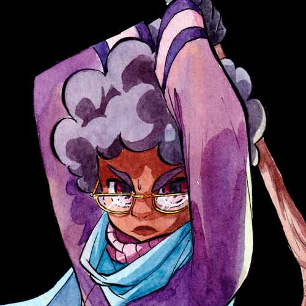
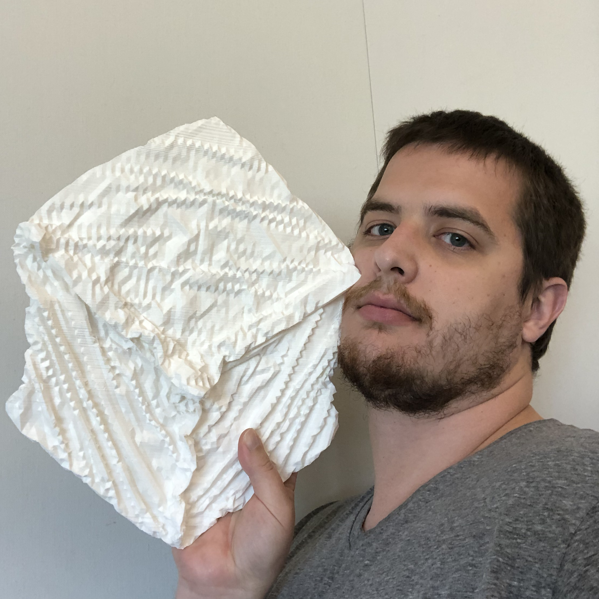
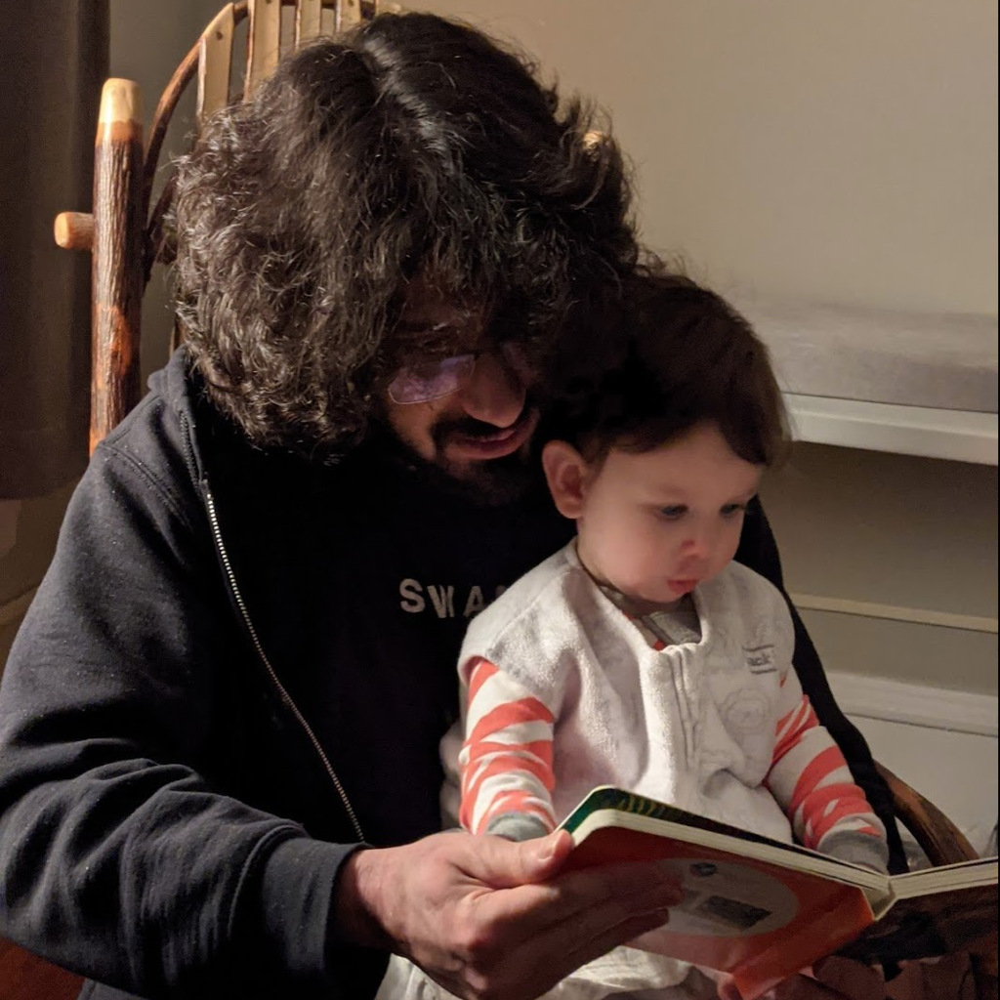
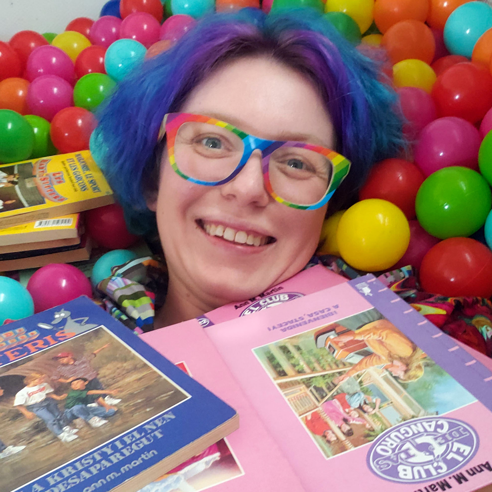
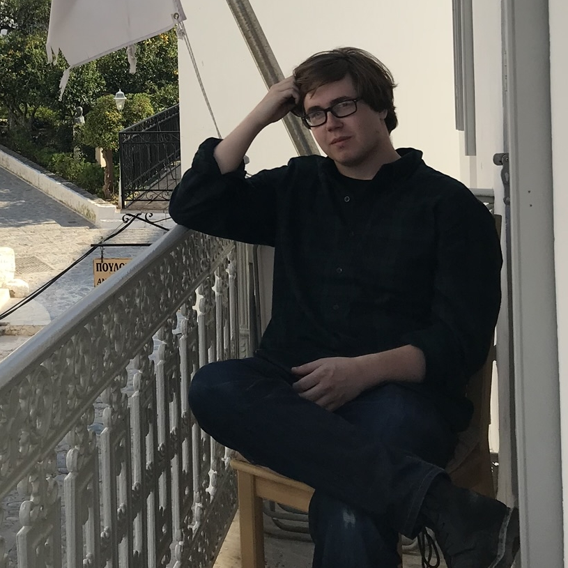

# Speakers

## Keynote Talks

### Angie Jones

**Angie Jones**  is a Java Champion and Senior Director who specializes in test automation strategies and techniques. She shares her wealth of knowledge by speaking and teaching at software conferences all over the world, writing tutorials and technical articles on angiejones.tech, and leading the online learning platform, Test Automation University.

As a Master Inventor, **Angie** is known for her innovative and out-of-the-box thinking style which has resulted in more than 25 patented inventions in the US and China. In her spare time, Angie volunteers with Black Girls Code to teach coding workshops to young girls in an effort to attract more women and minorities to tech.

---

<a name="kate-temkin" id="kate-temkin">

### Kate Temkin

**Kate Temkin** is a hardware hacker and low-level engineer who spends most of her time exploring the hardware/software boundary and figuring out how to empower people with educational technology. Her recent interests include building hardware, software, and gateware for USB development, reverse engineering, and hacking.

When not hacking hardware, she maintains a variety of open-source projects, including LUNA, ViewSB, FaceDancer, and GreatFET, and probably spends more time than she should reverse engineering and be creating educational materials.

---

## Lightning Talks

### Aaron A. Reed

<!-- 

-->

**From Oregon Trail to A.I. Dungeon: 50 Years of Text Games!**

<!-- desc -->

<!-- bio -->

---

### Alex Pounds

<!-- 

-->

**Let me at my data! Pulling pictures out of an undocumented file format**

<!-- desc -->

<!-- bio -->

---

### Alicja Raszkowska

<!-- 

-->

**The Brave Little Database!**

<!-- desc -->

<!-- bio -->

---

### Amara Jaeger

<!-- 

-->

**The Musical Password Manifesto: You Have Nothing to Lose But Your FRdqwcK7y23CYPq!!**

<!-- desc -->

<!-- bio -->

---

### Andrew Sillers

**Night of the living GIF: Making interactive multiplayer experiences on a static webpage! (pronounce "GIF" however you like :)**

The Web is full of opportunities to upload static HTML: blog comments, user profiles, and even emails can all host user-supplied text and images. But haven't you ever wished you could replace all your sleepy static content with real-time interactive multiplayer games? By harnessing the magic of HTTP and (mis)using the awesome power of GIFs, we'll do just that, with no JavaScript required!

**Andrew** is a programmer who thinks a lot about security. He enjoys copyright law, federated services, and surprising solutions.

---

### Anjana Vakil

<!-- 

-->

**It’s a picture! It’s a program!! It’s Piet!!!**

<!-- desc -->

<!-- bio -->

---

### Daniel Temkin

<!-- 

-->

**Dithers of the Error-Diffusion Kind!**

<!-- desc -->

<!-- bio -->

---

### Dasha Ilina

<!-- 

-->

**Do your eyes hurt? All you need is cardboard and motors*!! (*Ok, and a lot of superglue)**

The grim reality of working from home has finally entered almost every household. Though even before the pandemic, with the invention of the ‘freelancer’, so came the many gadgets to improve productivity and reduce discomfort from working from home or at an office. My response to the screen glasses, office chairs, or ergonomic mice was to build my own DIY versions with cardboard and a few motors. Did my solutions work? you ask. Sounds like you will need to attend the talk* to find out!

This talk* will give you an insight into how these sort of solutions can be made from the materials you have at home - with basic skills, many failed attempts, and lots of humor - in order to encourage you to build your own fixes to your problems!

**Dasha Ilina** is a Russian digital artist based in Paris, France. Her work explores the relationship we develop with the digital devices we use on a daily basis, specifically in regards to the human body. Ilina’s work centers around the notions of care and technology, DIY practices and low-tech solutions to examine various issues such as phone addiction, tech-related health problems and privacy in the digital age. She is the founder of the Center for Technological Pain, a center that proposes DIY solutions to health problems caused by digital technologies for which she has received an Honorary Mention at Ars Electronica. She is also the co-director of NØ SCHOOL.

---

### Jade Fink

<!-- 

-->

**pwintln!(): teaching an ELF to uwu!!**

<!-- desc -->

<!-- bio -->

---

### JeanHeyd Meneide

<!-- 

-->

**Oh, no! The Lowest-level* Programming Language is Unicode-aware and I have no excuses?!**

Goodness gracious! It seems like there's a lot of consternation that the lowest level programming languages and several newer ones do a very poor job of handling Unicode and giving people the means to handle it. And every day, people continue to say things like "only use alphanumeric ASCII letters and numbers for this form" day in and day out. Our names get truncated and filtered. We change ourselves and, for more important matters made digital (banking, flight tickets, and more), we have to reconcile what the computer allows and what people who control our lives see on our official documentation. Is today the day we need to be taken off to the side for a "random, routine inspection"?

Even if people are ratchet in the real world, these systems are digital. They are supposed to be able to do anything we want to, and yet we ended up here. Let's talk about how we got here, and more importantly,

let's talk about what we're doing right now to fix this godawful mess.

* Okay assembly, machine code, stream processing, etc. are all ""lower"" than C but practically speaking, you get what I mean!

**JeanHeyd “ThePhD”** is a student. They are the Project Editor for the C Language, and they manage their greatest open-source contribution – sol2 – that is used across many industries and academic disciplines. They are currently working towards earning their own nickname, climbing the academic ladder while spending as much time as possible contributing to C++ standardization and development. Their newest and biggest project is Unicode for C++. Learn more about JeanHeyd’s work at their website.

They very much love dogs and hopes to have their own in a year or so. They also like TWRP’s “Feels Pretty Good” from the album Together Through Time.

---

### John Feminella

<!-- 

-->

**Time for Time!**

Every modern computer ships with some flavor of a special database called tzdata, which codifies the world's diverse and varied viewpoints about how to standardize time.

This talk is about one very specific line in that gigantic store of information, what it means, and how every computer that needs to rely on time depends on this single, solitary idea being correct.

**Jhn** is an avid technologist, occasional public speaker, and curiosity advocate. He serves as a consultant, helping enterprises transform the way they write, operate, and deploy software.

John is interested in bits, bucks, bots, and blocks. He lives in Charlottesville, VA and likes meta-jokes, milkshakes, and referring to himself in the third person in speaker bios.

---

### Jon Kingsley

<!-- 

-->

**Ride on Model Railway Signalling using Kubernetes!**

<!-- desc -->

<!-- bio -->

---

### Kimberly Wilber

<!-- 

-->

**How layers upon layers of hacky abstractions turned Doom II into the best kart racer!!**

<!-- desc -->

<!-- bio -->

---

### Laura Kurup

<!-- 

-->

**Geometric derivations of RGB colorspace! The strange eyeball science that is messing with your LEDs**

<!-- desc -->

<!-- bio -->

---

### Lynn Pepin

<!-- 

-->

**Making a pixel-y circuit design language and then building circuits in it!**

<!-- desc -->

<!-- bio -->

---

### Martin Gaston

<!-- 

-->

**making our own napster so we can party like it’s 1999!**

<!-- desc -->

<!-- bio -->

---

### Michael Woods

<!-- 

-->

**Numeric Data Types in the Wild; or: Things I Learned From Last Night’s Dinner Receipt!**

<!-- desc -->

<!-- bio -->

---

### Nathan Kiessman

<!-- 

-->

**Bang Bang!! Hacking Switch Controllers to Play Rhythm Games Using A Real Drum!**

<!-- desc -->

<!-- bio -->

---

### Nicholas Carlini

<!-- 

-->

**GoLlURM! The Game of Life (limited) Unlimited-Register Machine!**

<!-- desc -->

<!-- bio -->

---

### Patrick Stefaniak

**Crocheted! Computer! Graphics!**

Making 3D graphics and creating textile art are surprisingly similar! In this talk I will show the work from my MFA thesis exhibition, CLOTH^3, which includes a videogame, a giant crocheted cube, and a series of 3D prints to explore the connections between these two disciplines. These threads are both historical, hearkening back to early computers like the Jacquard loom and circuits made by hand, and material, in the rendering of shapes from scattered points into lines > faces > volumes. By taking a craft approach to videogame design we can queer the gender configurations of labor like crocheting or programming and create new ways of working and playing.

**Patrick Stefaniak** is currently an MFA student in Digital Art + New Media at UC Santa Cruz, earned a BFA in Digital Art from Indiana University in 2015, and has worked in New York as a Creative Technologist. He works with 3D games, virtual reality, video performance, installation, writing, hole punching, crocheting, and 3D printing to think about rendering, perception, labor, queerness, and fun.

---

### Paul Pollack

**Enter the Minus World! Nintendo Cartridges Share Secrets!**

Secrets in video games are a funny thing. Sometimes they’re gifts from the developers that make you feel like you got somewhere you weren’t supposed to go. Other times… a game winds up in a state it wasn’t built to handle and you actually got somewhere you definitely weren’t supposed to go! Super Mario Bros. for the Nintendo Entertainment System has great examples of both of these kinds of secrets. The Warp Zone is a well-known and beloved portal into later stages of the game. I want to talk to you about another portal, one left completely by accident, that goes somewhere else: The Minus World!

The Minus World is a collection of levels composed entirely of arbitrary junk data in memory! In the US players discovered this place through dexterous maneuvering to outsmart the game’s collision detection logic. The results were fascinating but limited. A single level named “  - 1” (as in Minus World!) that repeated in a loop. I want to share with you all another method to enter this place that gives us access to a whole slew of possible levels! This technique was first discovered by some clever Japanese gamers by swapping out cartridges without turning off the console. As I demonstrate this effect we will talk about which hardware components are involved and exactly what they’re doing every step of the way!

**Paul** has a lot of hobbies and interests that move in and out of rotation over time. Sometimes he forgets about one for years and then suddenly remembers he liked doing the thing. Among these are electronics, music, mushroom hunting, and watching the Evil Dead trilogy. Paul writes software to make it easier for people to spend time outdoors for The Wanderlust Group.

---

### Paweł Marczewski

**It's like you're actually there! Mouse synchronization in an online tabletop game**

When working on an online tabletop game, I encountered the problem of mouse cursor synchronization. How to make sure my mouse, and the pieces I'm moving, animate correctly and smoothly for the other players? When done well, the effect really adds to the immersion, but there are a few subtle details.

**Paweł's** day job involves operating systems, but outside of work, he has always been making games. He likes interactive fiction, Japanese board games (Go and Mahjong), and rock climbing.

---

### Phil Salvador

<!-- 

-->

**I learned how to code and now I'm even more confused!**

<!-- desc -->

<!-- bio -->

---

### Pokey Rule

<!-- 

-->

**Cursorless: keyboards and mice are sooo last year!!**

<!-- desc -->

<!-- bio -->

---

### Quinn Dombrowski

**"Tropes! Cliches! Made-Up Slang! It's the Data-Sitters Club!"**

Did you ever pick up a "Baby-Sitters Club" book in the 90's, or stumble across the graphic novels or Netflix series more recently? The "Baby-Sitters Club" turns out to be an amazing corpus for exploring computational text analysis methods! Find out what the "Data-Sitters Club" has learned -- about these books, natural-language processing (in multiple languages), collaboration, and coding -- in this quick tour of our discoveries so far!

**Quinn** loves languages, digital humanities, and sewing brightly-colored clothes, and can often be found on Twitter at @quinnanya. Quinn works in the Library and the Division of Literatures, Cultures, and Languages at Stanford University, but lives in Berkeley with a husband, three small kids, and two geriatric cats.

---

### Rebecca Ravenoak

<!-- 

-->

**Nifty Weaving Tools: A Different Kind of Color Picker!**

<!-- desc -->

<!-- bio -->

---

### Richard Schneeman

<!-- 

-->

**Beware the Dreaded Dead End!!**

<!-- desc -->

<!-- bio -->

---

### Robyn Speer

<!-- 

-->

**Mojibake! What the h—ck happened to these strings?**

<!-- desc -->

<!-- bio -->

---

### Rocky Kev

<!-- 

-->

**NetMonster: A trip through early 2000s internet and the monsters hidden inside websites!**

<!-- desc -->

<!-- bio -->

---

### Sara Farquharson

<!-- 

-->

**It's my party and I'll build my own virtual social platform if I want to!**

<!-- desc -->

<!-- bio -->

---

### Sven Dahlstrand

<!-- 

-->

**Changing a Single Byte Saves Me Seconds Every Day!**

<!-- desc -->

<!-- bio -->

---

### Tom Verbeure

<!-- 

-->

**Option hack that 30 year old oscilloscope!**

<!-- desc -->

<!-- bio -->

---

### Wade Minter

**Building Weird Things With With The National Hockey League Using Ruby!**

If you're a Ruby developer who also moonlights as the arena public address announcer for a National Hockey League team, clearly the best thing to do is to write some odd bits of software using NHL data! In this talk, we'll discover how to use the semi-undocumented NHL API to do things like preparing your car for the drive home and having a script announcement goals for you! There's 10 minutes remaining in the period, so we'll see how to build weird and delightful software just for the fun of it!

**Wade** is a Product Principal at Dualboot Partners, where he helps companies build great software. He was a member of the founding team at TeamSnap, and headed up Engineering at Adwerx, WeaveUp, and Custom Communications. He is also the arena public address announcer for the NHL’s Carolina Hurricanes, a 20+ year improv performer, ring announcer for a professional wrestling federation, and beer league ice hockey player/goalie. He leads a weird life.

---

### wilkie

**Save Icons! In Real Life?! (My Love of the Floppy Disk!)**

Have you ever seen that image next to "Save" and thought "what the heck is that?!" Or perhaps you're nostalgic for the era of "Please Insert Disk 18." Either way, in 10 minutes, we will all be experts in that plastic card with a magnetic personality: the floppy disk! We will go over their history and construction and how, exactly, do simple magnets store information. And if you think we can't use these real life save icons to create modern art, well, I have a hidden surprise for you!!

**wilkie** is a systems programmer, wannabe archivist, and not a proper noun! I do research and development of federated systems for software preservation and archival, focused on scientific software and replicability.

---

### William Woodruff

**compilers HATE him: use this ONE WEIRD TRICK to hide a message in your x86 program!!**

Steganography is the art of hiding (not encrypting!) messages within otherwise inconspicuous data. Typical steganographic techniques involve media formats: images, movies, and audio. But what if we can hide messages within compiled programs themselves?? This talk will go through a whirlwind tour of steganography and the x86 architecture, and then show you ONE WEIRD TRICK in x86's instruction encoding that allows us to do exactly that!

**William Woodruff** is a security researcher at Trail of Bits, primarily doing DARPA-funded research into program (LLVM) and binary (x86) analysis. During his free time, he likes to blog, ride bicycles, and do a bit of open source work (most recently in Rust). He's slowly working on completing the system of German Transcendental Idealism.

---

### Zachary Kanfer

<!-- 

-->

**Making Music! In Emacs?!**

<!-- desc -->

<!-- bio -->

---

Perhaps you would also be interested in our [2020](2020/speakers.html), [2019](2019/speakers.html), [2018](2018/speakers.html), [2017](2017/speakers.html), [2016](2016/speakers.html), [2015](2015/speakers.html), or [2014](2014/speakers.html) speakers?
