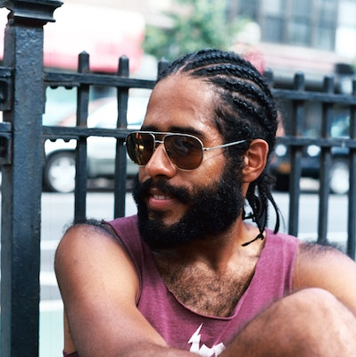
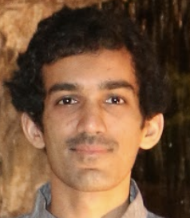
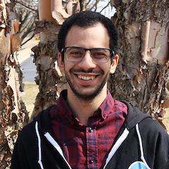
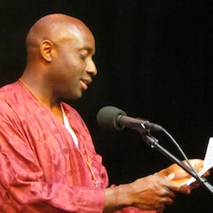

# Speakers

## Keynote Talks

### Nabil Hassein

**Nabil Hassein** is a freelance technologist and educator based in Crown Heights, Brooklyn. Besides working professionally as a software developer and a teacher of mathematics and programming in both public schools and private settings, Nabil participates in grassroots organizing against prisons and police in New York, and occasionally writes and speaks about the intersection between social and technical topics

---

### jenn schiffer

**jenn schiffer** is an artist and engineer from jersey city. she's the director of community engineering at glitch.com, where she gets to work with the friendliest community of people using code for all sorts of things. she can run faster than a car driving very slowly.

---

## Lightning Talks

### Allison Parrish

**Speling werds egspressively with rrkurrent nuril nedwirques!**

Spelling isn't just about memorization and following rules—it's a way of making meaning. I trained recurrent neural network models to spell words (translate phonemes to letters) and to sound words out (translate letters to phonemes) and I want to show off some of the weird outputs you can coax from the models if you poke them just right. I'll demonstrate how the models let me automatically ririt tixts without using potticulor l'tirs, generate strigs thadte soude like they have a ruddy doeds, and transmogrify words into their 1950s pulp sci-fi equivalents ("Welcome to Bang-Gan-Kan in M'anhoten Gnhu Yorq, puny terran!"). Along the way, we'll discuss why "jabberwocky" is spelled "jabberwocky," what Russian Futurists have in common with J.R.R. Tolkien, and why "standardized spelling" is kind of a fake idea.

**Allison Parrish** is a computer programmer, poet, educator and game designer whose teaching and practice address the unusual phenomena that blossom when language and computers meet. She is an Assistant Arts Professor at NYU's Interactive Telecommunications Program, where she earned her master's degree in 2008.

---

### Andrew Sillers

**Anything is possible! Unlocking the Nightmarish Power of JavaScript via `with` and `Proxy`**

JavaScript is often the butt of jokes about haphazard language design, but that jumbled design allows for some truly alarming power. If other languages let you shoot yourself in the foot, then JavaScript lets you grow tentacles and shoot yourself in those.

First, we'll dive into the mechanics of JavaScript's scope chain. Then, we'll learn how to break it by unmasking the secret lives of objects, variables, and identifiers. By combining one of JavaScript's most powerful features with one of its worst, we can create a pocket dimension of code where anything is possible and nothing is as it seems. In the end, we'll destroy JavaScript's ability to associate variables with their values, so that we can make any variable refer any value, irrespective of the code being run.

**Andrew** is a programmer who thinks a lot about security. Ask him about his opinions on federated services, homomorphic encryption, and copyright law.

---

### Ayla Myers

**Let's expand the meaning of "GAME FEEL"!! It ain't just the crunchy boomy bits!**

We've all played games that don't feel quite right. Sometimes they seem too floaty, sometimes that OOMPH factor is missing, and sometimes we get hit even when we're sure we pressed that dodge button in time. "Game feel" refers to how well a game's visuals, audio, design, and mechanics line up with how our brains think they ~should~ feel. But oftentimes, the conversation on "good game feel" ends up boiling down to crunchy sounds, tight controls, and excessive screen shake.

But in this talk we'll be going even further--let's explore the unknown reaches of game feel together! You think zero-latency inputs feel tight? How about ~negative~ latency? Let's talk about all the weird things we can do in the name of improving game feel, even to the point of breaking our games if it means matching our brains' silly expectations about how they should work.

**Ayla** is an independent game designer, developer, pixel artist, and fantasy console enthusiast! She spends her time crafting beauty out of code (and skating around the city when it’s sunny). She currently works at playcastle.io, happily contributing to a new platform for indie game devs.

---
<!--

-->

### David Mauricio Delgado Ruiz

**Hiding my love inside a MIDI file!**

Ever wanted to communicate a secret message to friend, lover or the national security officer of your country? (yes, I'm talking to you spies from all over the world). You might think end-to-end encryption got you covered, but after 2013, the NSA leaks and all that stuff, you never know! What do you do? You go back to the basics: Steganography! In this talk I want to share with you the basics of steganography and how you can use use it to hide messages in the vintage MIDI files we all loved from the 90's. More specifically, we are going to hide an audio message within the channels, patterns and events of a MIDI file. Finally, we will decode the message and listen to it!

**David** loves to help people realise that hard things are not so hard with a smile and hard work. He also cares a lot about the wellbeing of people in this fast-paced tech world. He believes that people who understand technology should use it with ethics and moral and that caring about your user is more important than the money you put in your pocket.

---

### Ellen Körbes

**Go For Phallic Object Generation!**

Installing a vagina makes the body go all "oh noes theres a huge gash here I better close it asap!!" To avoid that happening, there are dilators. They're used on the vaginal canal to, well, y'know, dilate it. And human bodies are very efficient—not dilating for even a single day may prove catastrophic.

Dilators are phallic, like a dildo, but they're not sex toys—they're medical devices. Not that it matters, depending on what kind of airport security you run into. If I take my dilators as carry-on, they might get confiscated; if I dispatch them, the bags might get lost. Given that I can't miss a single day... it's scary.

The solution is 3D-printable dilators. This way if something happens, just run to a hackerspace and print a new one. In this talk we'll see how to generate and render 3D objects with nothing but Go, in a way that's suitable for 3D printing.

**Ellen** is a developer advocate at Garden, and also an avid gopher, actively involved with Women Who Go, and responsible for the most comprehensive Go course in Portuguese. They've spoken at world-famous events, and at countless local meet-ups. Ellen is a proud recipient of a 'Best Hair' award.

---

<!---

--->

### Em Lazer-Walker

**I made a game you play by riding your bike!**

Making games that interface with the physical word can be tricky!

This talk will discuss a game I built to be played on a Bluetooth-enabled stationary bike. We’ll talk about my journey fighting BLE standards, and figuring out how to squeeze as many novel forms of input as possible out of off-the-shelf hardware, such as using the motion sensors built into the player’s iPad to figure out when they were turning the handlebars of the bike!

We’ll also explore what it means to create games that use weirder controls than a keyboard and mouse or game controller. My bike game specifically has two different versions: one meant to be played at home by cycling trainers with their own hardware, and an installation version for exhibitions and games events. What does it mean to design a game as a training tool — where “success" means a high-engagement game whose players show steady progress over time — versus an installation art piece where “success” means a thought-provoking interactive artwork whose gameplay supports an underlying political statement?

**Em** make interactive art, experimental games, and software tools. Above all, they make things that spark intellectual curiosity and inspire people to become self-motivated learners.

---

### Evy Kassirer

**Reverse engineering your mouth!**

As babies, many of us learn to talk by unconsciously figuring out how to move the muscles in our face. Let's learn to talk again, but this time by looking into what's going on under the hood!

[Pink Trombone](https://dood.al/pinktrombone/) is a web tool that lets users create sounds by interacting with a virtual oral cavity, nasal cavity, tongue, and throat. Are those building blocks actually enough for speech, and can we teach Pink Trombone to speak English words? What sounds are especially difficult to produce - for humans, and in the app - and why? Join me in digging into the technology behind this app and learning more about how our voices really work.

**Evy** loves to sing (especially with others) and code (especially for social good). She loves her communities.

---

### Geoffrey Lessel

**Custom Sudoku Books with Ruby!! and LaTeX!!**

My father loves sudoku puzzles and for a while, solved one every night before bed. For two Christmases in a row, I created a custom book of 365 sudoku puzzles for him solve. Each week's puzzles were harder than the previous week's and required more advanced solving strategies. We'll travel through the world of sudoku puzzle generation, difficulty categorization, puzzle selection, and PDF layout all within Ruby and LaTeX.

**Geoffrey** has had an interest in programming ever since his family had a 286 in the family room growing up. He's developed for fun and profit for three decades in all sorts of languages. Geoffrey recently released Phoenix in Action with Manning Publications.

---

### Jayesh Kawli

**Compute geolocation from object shadows!**

Inspired by the paper [Determining the Geographical Location of Image Scenes Based on Object Shadow Lengths" by "Frode Eika Sandnes](https://www.researchgate.net/publication/220541439_Determining_the_Geographical_Location_of_Image_Scenes_based_on_Object_Shadow_Lengths), I am going to talk about how geolocation can be calculated from object shadows. This method needs a simple setup and uses a mathematical algorithm to compute a rough geolocation of the place where the experiment is conducted.

Through this talk, I will share my experiences making a set up for an experiment just by using cardboard, a pen, and a 2-megapixel camera. We will also look at simple algorithms utilized to make geolocation computations along with cool plots and images. Finally, we will touch upon some of the things that could potentially be considered in order to get better and accurate results.

**Jayesh Kawli** is an iOS developer currently working for [Wayfair](https://www.wayfair.com/) in Boston, Massachusetts. He has been writing iOS applications for more than 5 years and currently acts as a tech lead for the checkout team on Wayfair iOS application.

As a senior developer, he likes to share his knowledge and experience with other people. He has presented a variety of topics at his company's internal Lunch and learn meetings, local meetups as well as on the international platform. He also writes [a blog](https://jayeshkawli.ghost.io/) which touches active topics in iOS development along with occasional off-topics such as food, travel and web development.

---

### Josh Triplett

**Build your own virtual machine with /dev/kvm and Rust!**

Virtual machines are much simpler to build than they seem! I'll show how to build a complete virtual machine on Linux using the /dev/kvm interface, load and run code, and even implement your own virtual devices using virtio! I'll explain the interface, and show some libraries in Rust that help you build more complex virtual machines. By the end of the talk, you'll not only know the foundations of cloud computing, but you'll have ideas for other novel uses of virtualization as well!

**Josh Triplett** hacks on system software, including Rust, virtual machines, the Linux kernel, X, Git, Sparse, Debian, Chrome OS, and firmware. Josh enjoys using software for unconventional purposes, such as porting Python to GRUB2. Josh has previously presented at linux.conf.au, Linux Plumbers Conference, Embedded Linux Conference, LinuxCon, RustConf, PyCon, Kernel Summit, Open Source Bridge, and the USENIX Annual Technical Conference.

---

### Ju Liu

**Do Parsers Dream of Electric Guitars?!**

As a guitarist, I've always been fascinated by chords and their infinite variations. In this talk, we'll see how we can build a program that reads a chord sheet, understands chords on a deeper level and finds ergonomic ways to play them on a real guitar. We will do this using a simple parser using Elm and show how much cooler it is compared to a good ol' regular expression. Then, we'll see what it takes to teach our program how to play the ukulele!

**Ju** was born in China, moved to Italy as a kid, grew up eating a lot of pasta, and started messing around with computers. He now lives in London and works for NoRedInk. He loves to solve interesting problems and build amazing products. When he’s not doing that, he’s probably rock climbing.

---

### Kate Beard

**Let's build a live chat! 👍from the 1800s (?!) 🤔using modern web technology!!! 😮**

Livechat? From the 1800s?!! No, I'm not talking about AOL or MSN (though it does feel that long ago sometimes). I'm talking electrical telegrams and Morse code.

Inspired by a scene The Rescuers Down Under and a keenness to learn the web audio API , I built a program that takes written text and turns it into an audio Morse code message. Then once that was built, I took it to the logical next step: building a chatroom where you can send and receive messages in Morse code with all your coolest and extremely online friends.

Follow me on a journey full of discovery, gifs of mice sending telegrams, oscillators, websockets, and more in putting together this weird, almost entirely useless thing. Fluency in Morse code not required (but would be awesome!!!)

**Kate** is a former photographer, writer, barista, and linguistics graduate who found her love of programming early last year. She learned to code at London's nonprofit, peer-led coding bootcamp, Founders and Coders, and now works at the Financial Times as a junior engineer. When she isn't coding silly side projects in her spare time, she's probably drinking coffee, patting her guinea pigs, or thinking about drinking coffee and patting her guinea pigs.

---

### Lee Butterman

**Poeta Ex Machina! How To Teach Computers To Chant Latin Poetry!**

We don't often hear Latin poetry! And there are lots of programs designed to synthesize human voices! We can piece together what we infer of how Latin poetry was pronounced and chanted to make a web app that recites Latin poetry on demand! We can start with freely available concatenative synthesis, with a few building blocks: determining basic pitch by word accent and volume of air in the lungs, freely available human voices from many languages, and a few hundred lines of code to glue it together. There will be audio from many different types of speech synthesis, and the web app is live at [poetaexmachina.net](http://poetaexmachina.net/)!

**Lee Butterman** is a programmer and an enthusiast of Latin and Greek. He created the first text-to-speech engine for Latin, [poetaexmachina.net](http://poetaexmachina.net/), and his website [nodictionaries.com](http://nodictionaries.com/) has helped countless students read Latin over the last decade. He lives in California.

---

### Melody Starling

**low-fi hip hop beats to npm install to!!**

Listen to your computer. You may hear the faint sound of fans, the quiet hums of electricity, and the occasional clanking of keyboards. But what if I told you there are other ways to listen to your computer? There are tons of things happening in the background of an operating system, and with the power of of a digital synthesizer, you can hear (and relax to) the sounds of a package manager hard at work!

**Melody** is a web developer, designer, and community event organizer based in Philly. You can find them on Twitter at [@pixelyunicorn](https://twitter.com/pixelyunicorn).

---

### Michael Malis

**Writing an Interpreter in SQL for Fun and No Profit!**

Writing SQL can be hard. SQL code is a bizarre combination of yelling and relational algebra. How can we make writing SQL easier? By embedding our own programming language in our SQL queries of course!

In this talk, we'll take a look at how you use a combination of various Postgres features to build a programming language out of SQL.

**Michael Malis** leads the database team at Heap. For his day job he works on optimizing a petabyte-scale Postgres cluster. His hobbies include bouldering and meditating.

---

### Nat Alison

**We Love Polyhedra! (And So Should You!)**

For millennia, mathematicians have marveled at the beauty of polyhedra, the most fundamental of 3D shapes. For years I have admired and researched these figures, and now it is time to me to present my findings. Through the magic of *3D graphical software* (oooh), I'll show you the hidden secrets and relationships of the humble tetrahedron, the stalwart cube, and the rare triangular hebesphenorotunda. We'll talk about symmetry, beauty, and form as we embark on a mathemagical journey together.

**Nat Alison** is a freelance software engineer. She has gotten first place at Tetris 99 ten times. If you are stuck in a room with her, she *will* start talking to you about shapes. You've been warned.

---

### Omar Shehata

**Learning to See in 4D**

In this talk I'm going to teach you how to look at a 4 dimensional cube! We'll use a 4D geometry visualizer I built on top of Three.js. Yes, your eyes can't _really_ see in 4D, but you can't _really_ see in 3D either and that hasn't stopped you! Our eyes just see 2 dimensional images - it's in your brain that the 3D scene is reconstructed. So there's no reason you can't do that for one dimension up.

Mathematically, high dimensional geometry has many useful applications. But I'm not going to tell you about any of that. I'm a graphics programmer - I just think it's so cool that we can actually look at these objects! And in doing so, we learn a little bit about vision and perception.

**Omar** is a graphics programmer at Cesium working on open source, web-based 3D maps. He deeply believes in the value of an open, accessible web. As a kid growing up in Alexandria, Egypt, websites like Newgrounds gave him a chance to collaborate with people from all over the world and reach audiences of millions with his Flash games. It didn't matter how old you were, or where you're from. Their motto was "Everything by Everyone". You can check out all his stuff on his [personal website](http://omarshehata.me/).

---

### Peter Sobot

**Even more vintage: releasing music on a custom-built Game Boy cartridge!**

Hip musicians are releasing their work on vinyl these days. Some artists even release on cassette tape. Is it possible to be even more hip? The answer is yes: I helped a friend release their album as a playable Nintendo Game Boy game!

I'll go over the adventures of putting this project together, from designing and building hardware for full-quality audio playback, writing assembly code for multiple platforms, reverse engineering 30-year old hardware, and gluing it all together with code in Python, C, and Make.

**Peter** is an engineer and musician from Toronto, currently living in Brooklyn. His business cards say "House Drummer at Spotify" but his manager keeps reminding him he gets paid to help make Discover Weekly better.

---

### Pranshu Bajpai

**Tales from the Underground: Hilarious Cybercrime Fails!!**

Hilarity ensues as cybercriminals fail miserably in their objectives in these tales. Hackers have a fearsome reputation thanks to their sustained glorification in Hollywood. However, not all of these “l33T hax0rs” can boast real skill (...or any skill for that matter). A vast majority of these cybercriminals are script kiddies relying heavily on cargo cult programming and acquired tools. Surface level knowledge combined with the firm refusal to truly comprehend the tools being used, creates a perfect opportunity for comedic moments as these cybercriminals make ridiculous errors in design, operation and implementation.

**Pranshu Bajpai** ([@amirootyet](https://twitter.com/amirootyet)) is a security researcher working towards his PhD in Computer Science and Engineering at Michigan State University. His research interests lie in computer and network security, malware analysis, digital forensics, and cybercrimes. In the past, he worked as a penetration tester. He has been an active speaker at conferences and spoken at DEFCON, APWG eCrime conference, GrrCon, ToorCon, CascadiaJS, BSides, BangBangCon and others. He loves classic rock music and playing sports.

---

<!--

-->

### Randall Reed, Jr.

**Tic-tac-toe should not be this complicated!**

Almost 18 years ago, I submitted a high school research paper to a local science fair about using quasi-fractals to determine a winning strategy for tic-tac-toe. My paper was rejected with one judge noting "Tic-tac-toe should not be this complicated!" Fortunately for us, I've learned a lot about programming since then (like data structures, game trees, and heuristics), so let's find out how much more complicated I can make it!

**Randall** wishes he could spend more time in Paris. He likes eating Golden Grahams, writing in notebooks, and doubling down in Blackjack.

---

### Sarah Withee

**I Built an Artificial Pancreas!**

One of the coolest open source projects I've seen in a while has been OpenAPS, the Open-source Artificial Pancreas System. It originally piqued my interest since I'm also a type 1 diabetic. Could a small hardware device really do the work of one of my organs? Was it safe? How's it work? Could it be hacked? I'll address all of these, as well as quickly show off my artificial pancreas, in this lightning talk.

**Sarah Withee** is a polyglot software engineer, international public speaker, teacher and mentor, and hardware and robot tinkerer located in Pittsburgh, PA. She has a passion for technology and has ever since she wrote her first computer programs in elementary school. She captivates audiences with both popular and powerful technical and anecdotal talks. She gives workshops to teach programming and hardware building to women in tech, as well as to students of all ages. She's mentored middle and high school robotics teams to world championships. She's even co-organized six conferences and is the director of programming for Abstractions conference.

---

<!---

-->

### Sophie Déziel

**I built a robot to cheat at Pokemon!!**

A bunch of servomotors and a webcam is all you need to let a computer play some video games right? Turns out you have to work hard to be lazy. That's what I've learned putting the pieces together to automate exchanging fossils in hope of getting a shiny Omanyte in Pokemon Let's Go Pikachu. In this talk, I'll show you what pieces of Open-Source software I use to control almost any hardware from a web browser.

**Sophie** works as a web developer in Montreal. She is also a streamer on Twitch, creating french content about electronics and programming.

---

### Tessa Alexanian

**Life isn't logical! It's hard to put NOR gates in bacteria!**

Bacteria: nature’s nanobots. In response to their surroundings, bacteria chase after food, change their shape, cooperate with one another, and otherwise appear to have a fair bit of computational power hiding within their cell membranes.

Synthetic biologists (like me!) love talking about the “genetic circuits” that bacteria use to make decisions, but the truth is that DNA and proteins are far more annoying circuit components than the transistors we use to build computers.

Let’s look at one of the simplest (but coolest!) boolean logic gates, the NOR gate, and talk about why it’s easy to implement with transistors and hard to implement in living cells.

**Tessa** spends a lot of her time trying to make robots do biology experiments. She also likes impractical circuits, elaborate costume parties, musing about biosecurity, organizing effective altruist events, and irritating her American coworkers by spelling ‘behaviour’ with a ‘u’.

---

### Vaibhav Sagar

**You Won't Believe This One Weird CPU Instruction!**

Most CPU architectures include some variant of the `popcnt` instruction, which
counts the number of bits set in a word. What makes this seemingly niche
operation so important?

I'll demonstrate a few situations in which this turns out to be incredibly
handy.

**Vaibhav** ([@vbhvsgr](https://twitter.com/vbhvsgr)) used to write web applications for a living. He still does, but he used to, too. When he's not doing that he yells about package managers on Twitter and re-racks bumper plates after using them.

---

<!---

-->

### Veena Sankaranarayanan

**Manual algorithmic art: You can draw an Indian floor pattern that covers an infinite area!**

Women in India have been practicing the algorithmic art of Kolam for generations. Believed to have originated over 5000 years ago, kolams adorn the threshold of every house in India. The simplest form, practiced widely in South India is a knotted kolam where dots are placed in a grid-like framework and symmetrical patterns are traced around the dots. This talk addresses the maths behind a specific kind of knotted kolam, which uses the Fibonacci series to generate square and rectangular patterns of any size. After this talk, anyone in the audience will be able to draw a square/rectangular knotted kolam of any size!

**Veena** works with technology to help liaison between Insurance companies and their clients at Empyrean Benefits Solutions. Besides her work, she enjoys the math in everything, and practising South Indian Classical Music.

---

### Victor Dibia

**Dance of the Ancestors: I used Neural Networks to Re-imagine African Mask Art !!**

African mask art are a reflection of culture, beliefs, religion and ancient history from many parts of Africa. In this work, I curate a dataset of 11000 images of African Mask art and train a Generative Adversarial Neural Network (GAN) that learns to generate new masks. The modes learned by the GAN (geometry, texture, material) suggest interesting interpretations and conversations that draw attention to the underrepresented area African Art. I also discuss findings on the quality of results, novelty of generated samples, and the impact of data quality on image quality.

**Victor** is a researcher, passionate about the intersection of Human Computer Interaction and Artificial intelligence. He is a forever amateur musician, loves to play the piano, guitar and sing.

---

## Lightning Talks*

### Anjana Vakil

**Tail Call Optimization: The Musical!!**

"Stack overflow"!
"Maximum call stack size exceeded"!!
"Too much recursion"!!!

You may have seen errors like these thrown when you attempt to run a deeply recursive function. Computers can be so dramatic! But what's the conflict, exactly, between recursion and call stacks? And is there any hope for resolving it into a happy ending? In this musical talk we'll see why recursion poses a problem for the finite-memory call stack in our language runtime (we'll use a JavaScript engine as an example), and learn how "Tail Call Optimization" (TCO) - a particularly cool implementation feature of some engines - lets us get around that problem, when paired with so-called "tail-recursive" functions. We'll sing our way through the meaning of these terms to explore how TCO messes with the call stack (in a useful way!), as we mess with the lyrics to some of our favorite animated musical songs (in a nerdy way!).

**Anjana** suffers from a debilitating case of curiosity, which led her from philosophy to English teaching to computational linguistics to software development. As Engineering Learning & Development Lead at Mapbox, she can usually be found in San Francisco; that is, when she's not speaking at events around the world, trying to share the joy of coding and advocate for a more diverse & accessible tech industry. Ask her about the Recurse Center, Outreachy, and Mozilla!

---

### Dawn Xiana Moon

**Musician experiments: I fed a bot my songs and asked it to write more! Plus: A concert!**

What happens when you ask a bot to be your co-writer?

For over 15 years, I've been a singer-songwriter that's performed throughout the Midwest and East Coast. One night, I found a cute little virtual robot hanging out on the internet that wanted to become a songwriter too! But the poor thing had only generated random text before. So I fed the bot 80 of my original songs and asked it to write lyrics based on that material.

Then I took its lyrics and set them to music. Robot co-writing! I'll talk about this process and give you a  mini-concert featuring my favorite bot's writing – and together we'll look for meaning in the little bot's music!

**Dawn Xiana Moon** is a singer-songwriter who blends folk pop with jazz and traditional Chinese music; she's released two albums and performed in 10 states. She's also the Founder/Director of Raks Geek, a bellydance and fire performance company based in Chicago, and writes essays about pop culture and social justice. When she's not feeding her wanderlust, she's also a UX designer and web developer - and a bellydancing Wookiee.

---

<!---

-->

### Liz Fong-Jones and Sarah Voegeli

**Distributed Systems are Beautiful!!**

Distributed systems unintentionally create art as a byproduct of their execution! The traces that requests passing through the system generate are beautiful, as are, the graph of their dependency relationships, the synchronicities in the log lines, and the heatmaps and lines that plotting metrics can show. All of these both illuminate patterns in the behavior of the systems as well as aesthetically please our senses. This is an exhibition of some of the most fascinating and beautiful work we've encountered.

**Liz** is a developer advocate, labor and ethics organizer, and Site Reliability Engineer (SRE). She is an advocate at Honeycomb.io for the SRE and Observability communities, and previously was an SRE at Google.

**Sarah** is a UX designer and front-end developer at Github. Her mission is to create rewarding user experiences that help people achieve whatever they set out to do. She curates @TimeseriesArt

---

### Jes Wolfe!

**Paper Synthesizer! Music created with Augmented Reality**

This will be a combination talk and short musical performance. I'll demonstrate a small Dynamic Medium / Augmented Reality rig - using projection mapping to bring the digital world onto a surface of a table (rather than using glasses or a screen) and a webcam to read handwritten data on pieces of paper back into the computer. I'll explain how all this works and then use this system as the UI to create and perform an original piece of music.

**Jes Wolfe!** is a computer programmer who, in some contexts, refers to themself as an “artist” and/or “musician”, and they are especially interested in the aesthetic consequences of algorithms. They live in a house in the woods in Portland, Oregon, and they are doing yet another startup.

---

### Uche Ogbuji

**Yes yes ya'll! Miles of !malloc() and free() styles!¡!**

It was the early 90s. C++ surging, so you worried C might be fading, just like poetry. Wick-wick-widdack! Hip-Hop was in its golden age, and it would save poetry. Fr-fr-fresh! If freestyle could save verse, why couldn’t it save the malloc() and free()? Microphone check micro-microphone check-ah!

I learned how to program (BASIC then Z80 assembler) while UTFO were battling The Real Roxanne and the L=A=N=G=U=A=G=E poets were still bombing every wall with foul wack juice. I was just getting into University in Nigeria, where we didn’t have the latest, so my nostalgia goes back even further, to FORTRAN 4 and punched cards, boyeeee! back to when James Brown was laying down funk architecture for 90s DJs on MPCs (…rolling in MPVs every week they made 40 Gs!). Hyeeey! I need those hits!

I’ve never stopped programming (how I eat now, yo!), living my deep-nerd Hip-Hop life, reading and writing poetry. Now I’m ‘bout to bring these all together for ya’ll. A nostalgia trip straight off the dome, right there in the Big Apple, the realness, the foundation. Best be dipped in some Karl Kani or FUBU that day! So fresh and so clean-clean!

Morning of the talk I’ll tweet a call: nostalgic programming topics for a freestyle-flavored series of poems. I’ll select a few for the show, ten minutes to flow, taking the rhymes where the crowd wants to go. Might even bite live inspiration from talks preceding mine. Oh yes, I’m ah need some audience participation to keep it hype! Clap your hands everybody! Everybody just clap your hands!

**Uche Ogbuji**, more properly Úchèńnà Ogbújí, was born and largely educated in Nigeria, pursuing engineering because his parents hollered: "Literature?! You want to starve?!". Stubborn, he writes code and tech articles by day, but reads, edits, writes and performs poetry by twilight and less.

---

Perhaps you would be interested in our [2018](2018/speakers.html), [2017](2017/speakers.html), [2016](2016/speakers.html), [2015](2015/speakers.html), or [2014](2014/speakers.html) speakers as well?
