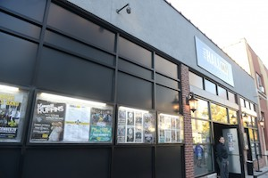

 

## Venue and accessibility information

We're excited to announce !!Con 2016's venue:
[the Hall at MP](http://thehallbrooklyn.com/) in Brooklyn, NYC!

### Getting there

The Hall is at **470 Driggs Avenue** in Brooklyn, NYC.  It is 0.2
miles from the Bedford Avenue subway station
([L](http://web.mta.info/nyct/service/lline.htm) line), 0.4 miles from
the Metropolitan Avenue station
([G](http://web.mta.info/nyct/service/gline.htm) line), and 0.9 miles
from the Marcy Avenue station
([J](http://web.mta.info/nyct/service/jline.htm)/M/Z lines).

The Marcy Avenue station is
[ADA accessible](http://web.mta.info/accessibility/stations.htm#brooklyn)
and there are elevators at the corner of Marcy Avenue and Broadway.
You can
[check elevator status](http://advisory.nymta.info/EEoutage/EEOutageReport.aspx?StationID=4C108099-5012-4A56-ACF4-601F32327B10&Station=MARCY%20AV%20STATION%20-%20J/M/Z)
before your trip.

Detailed
[subway and driving directions](http://thehallbrooklyn.com/about/directions/)
are available on the venue's website.

### Bigger and better!

For space reasons, past !!Cons have been limited to just over 100
attendees.  This year, we'll have capacity for **200+ attendees**.
YES!

We're painfully aware that in the past, a lot of people who have
wanted to attend !!Con weren't able to snag a ticket due to our
limited space.  We're hoping to do a lot better in that regard this
year!

Plus, we'll have a professional-quality sound and lighting system!
(And professionals who know how to run it!)  Sweet.

### Alcohol-free and all-ages

We remain an **alcohol-free event**, as always.  All ages are welcome.
(Don't be misled by the fact that we're holding the event at a music
venue and event space that often serves alcohol!  That doesn't apply
to !!Con.)

### CART captioning

!!Con 2016 will have CART ("Communication Access Realtime
Transcription" or "Computer-Assisted Real-Time", depending on who you
ask) live transcription in English, provided by Certified CART
Provider [Mirabai Knight](http://stenoknight.com/).  Mirabai first
captioned !!Con in 2014, and it was great.  We're excited to have her
back for an encore!

_Do you require other accommodations or have concerns or questions
about accessibility at !!Con?  We're here to help!  Contact
[the organizers](index.html#organizers)._
