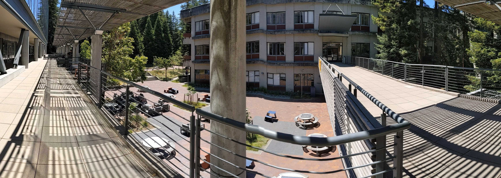

# Venue

!!Con 2024 will be held *outdoors* (!!), on August 24th and 25th, in the courtyard of the [Baskin School of Engineering](https://engineering.ucsc.edu/), on the campus of [UC Santa Cruz](https://www.ucsc.edu/), in sunny and scenic Santa Cruz, California, USA.  Santa Cruz is a joy of coastal California redwoods, about an hour&rsquo;s drive from the bustle of Silicon Valley.

## Courtyard

It will be hot and sunny outside!  We strongly recommend bringing your own refillable water bottle (we'll have water available at the venue, too), sunscreen, sunglasses, and possibly an umbrella or a small personal fan.

The courtyard itself will be sunny.  If you need to take a break from the heat, there are shady areas surrounding the courtyard, and a shady redwood forest is a two-minute walk away.

Here are some pictures of the courtyard. Imagine the stage (from which speakers will present) set up against the building on the right, against the bike racks, and lots of chairs in the middle.

## Getting to Santa Cruz

### By car from the Bay Area

* The best way to get to Santa Cruz from most of the Peninsula is by way of CA-17,
which takes you from CA-85 through the Santa Cruz mountains into the city.
* Please make sure you leave sufficiently early, as CA-17 gets heavy traffic southbound on weekends.
* Another option, if coming from San Francisco, is to drive down by way of
Half Moon Bay on CA-1, which would take about an hour and a half without traffic.
* On rainy days, CA-17 can present adverse conditions, including car crashes
and mudslides, sometimes even leading to closure of the highway and long delays. We don't anticipate rain (it's very rare at this time of year), but even so, please make sure to drive carefully and check the local news for transit conditions.

### By air

The best options for getting in and out of the Bay Area by air are either
through San Francisco (SFO), or through San Jose (SJC).  There are tradeoffs
for each; there are more flights in and out of SFO, but SJC is about half an
hour to an hour closer to Santa Cruz. Both airports have shuttle options to
Santa Cruz, if you don&rsquo;t wish to rent a car.

### By other alternatives including public transit

Santa Cruz is somewhat remote and the public transit options are limited,
but getting there without driving or flying is possible! 

The [Highway 17 Express](https://www.scmtd.com/en/routes/202440/17/we_ib) bus runs between Santa Cruz and San Jose Diridon Station.  San Jose Diridon Station is the nearest Amtrak/Caltrain station to Santa Cruz.
