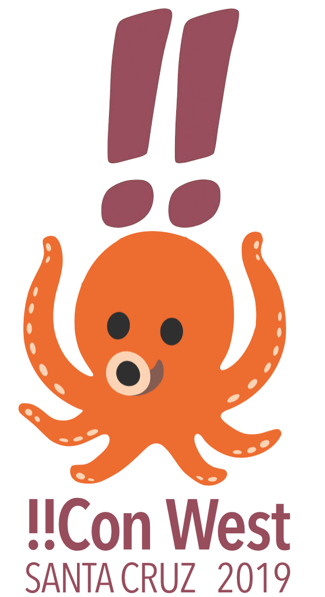

Interested in helping organize !!Con West?  [Apply to be an organizer!](https://docs.google.com/forms/d/e/1FAIpQLSfRIRU9W7TFlh8wx_VcyiJL1WFNm6LmiS5RvXWy4tz96gPgug/viewform)

# Frequently asked questions

## What's all this, then?

[!!Con](http://bangbangcon.com) (pronounced "bang bang con") is a two-day conference of ten-minute talks about the joy, excitement, and surprise of computing that's been held annually in New York [since 2014](http://bangbangcon/2014).  Due to [massive demand](http://composition.al/blog/2017/03/31/scaling-bangbangcon/), in 2019 we're expanding !!Con to the west coast.  _!!Con West_ will be held in Santa Cruz, California, on the campus of [UC Santa Cruz](https://www.ucsc.edu/), in early 2019, most likely in February.

## Why are you bringing !!Con to the west coast?

In our five years of organizing !!Con, we've learned that there's a huge amount of demand for what we're doing.  This is a great problem to have, but it means that we're constantly having to disappoint people. There’s only so much that our small team of volunteers can do.

The long-term solution to our inability to meet demand is for there to be a lot more conferences inspired by !!Con, in a lot more places, organized by a lot more people.  A new generation of conference organizers will need to step up.  In fact, that's already happening -- [EnthusiastiCon](https://www.enthusiasticon.de/), [Hello, Con!](http://hellocon.net/), and [StarCon](https://starcon.io/) are three examples of !!Con-inspired, independently organized events.

But the existence of all these great conferences hasn't taken the pressure off !!Con.  If anything, the demand for !!Con has only increased as more and more people experience the magic and fun of this conference format.  In 2018, for instance, we got nearly 300 talk proposals for only thirty talk slots. It's clear that we need to expand, not only to better serve our existing audience, but also to better serve those who can't easily travel to New York for the weekend.

## How big an event will this be?

!!Con West, like the original !!Con, will be a two-day, single-track conference with 200-300 people in attendance and around thirty speakers.  We anticipate that the organizing team will be around eight people in total.

## How will !!Con West be different from the original !!Con?

The west-coast version of !!Con will necessarily be different from the east-coast version in certain ways.  For starters, the !!Con West venue is very different from the middle of Manhattan or Brooklyn, where all the previous !!Cons have been held, and this will have a big impact on the conference experience.  We can't expect attendees to be able to easily get to our venue on public transit, nor is it likely that attendees will be able to wander out to restaurants for lunch and be back in time for the afternoon talks.  On the other hand, it's very likely that attendees will be able to walk out of the building and three minutes later be strolling through a beautiful redwood forest.

We should be willing to try doing things differently from the original !!Con when it seems like the right approach.  We want to retain the important aspects of the original !!Con's [aesthetic](https://recompilermag.com/issues/extras/toward-a-bangbangcon-aesthetic/), while enthusiastically embracing the physical and social geography of the west coast, Santa Cruz, and UC Santa Cruz.

## Who's organizing it?  Can I help?

!!Con West will be organized by a subset of [the existing !!Con organizing team](http://bangbangcon.com/#organizers), plus a new, to-be-determined group of organizers that we'll choose from among people who [apply for the role](https://docs.google.com/forms/d/e/1FAIpQLSfRIRU9W7TFlh8wx_VcyiJL1WFNm6LmiS5RvXWy4tz96gPgug/viewform).  We have two goals for !!Con West. First, of course, we want to put on another great conference in the !!Con tradition. Second, we want to incubate a new generation of conference organizers. By the time we're done, every member of the !!Con West organizing team will have the skills and experience to go out and launch their own conferences, if they want to.

If that sounds like something you want to do, [apply to be an organizer!](https://docs.google.com/forms/d/e/1FAIpQLSfRIRU9W7TFlh8wx_VcyiJL1WFNm6LmiS5RvXWy4tz96gPgug/viewform)

## What will organizers do?  What kind of skills do I need?

Jobs that the organizing team might need to handle (or pay professionals to handle) include:

  * A/V: recording and streaming talks, providing live captioning, etc.
  * Finding and coordinating sponsors
  * Speaker hospitality and logistics
  * Venue logistics
  * Website and social media management
  * Keynote speaker selection
  * Speaker candidate outreach
  * Talk proposal anonymization and reviewing
  * Food and beverages
  * Budgeting and accounting
  * Business and legal stuff (for instance, we currently have an LLC, but it might make sense for us to set up a non-profit organization)
  * Shirts, lanyards, signage, etc.

We'll have help from the professional event staff at UC Santa Cruz with some of this stuff, too.

You don't necessarily have to have existing event organizing experience, although it might help.  We especially welcome organizers who bring fresh ideas for how to improve !!Con.

## What kind of time commitment is required from organizers?

It depends on individual circumstances, but we expect most organizers to be able to commit around 5 hours per week for !!Con West, starting around October 2018 and lasting until around March 2019.  The work will be "bursty" -- some weeks there'll be more to do, other weeks less.  We also expect most organizers to be able to attend the event in person in early 2019.  (We can cover the cost of travel and lodging for organizers)

## I want to help organize -- by when do I need to apply?  When will I hear from you?

The [application form](https://docs.google.com/forms/d/e/1FAIpQLSfRIRU9W7TFlh8wx_VcyiJL1WFNm6LmiS5RvXWy4tz96gPgug/viewform) will be open until **Friday, July 13**.  After that, we'll review the applications and respond to each serious applicant by the end of July or so.

## I have a question that isn't covered in this FAQ.  Who can I ask?

Contact Lindsey Kuper [by email](lindsey@composition.al) or [on Twitter](http://www.twitter.com/lindsey)!
